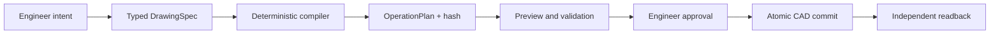

# AutoCAD Mechanical Harness

[](https://github.com/xuanquangIT/autocad-mechanical-harness/actions/workflows/ci.yml)
[](LICENSE)
[](pyproject.toml)
[](https://modelcontextprotocol.io/)

Safety-first, deterministic 2D mechanical CAD automation for AutoCAD through the Model
Context Protocol (MCP).

An AI client describes engineering intent as a typed `DrawingSpec`. The harness computes
every coordinate in a pure geometry kernel, creates a reviewable operation plan, previews
and validates it, and requires an engineer to approve that exact plan and drawing revision
before any live write.

> [!IMPORTANT]
> This project is an engineering preview, not a certified production system. The default
> adapter is non-writing. Live AutoCAD writes require explicit setup, an approved plan, and
> a disposable drawing for acceptance testing.

## Why this project exists

General-purpose agents are useful at interpreting intent, but they should not improvise
manufacturing geometry or silently mutate a drawing. AutoCAD Mechanical Harness separates
probabilistic intent handling from deterministic engineering execution:



The design is deliberately local-first, revision-aware, idempotent, and auditable. It is
useful both as a working CAD harness and as a reference architecture for bringing AI agents
into safety-sensitive desktop engineering workflows.

## Current capabilities

| Area | Current state |
|---|---|
| Deterministic creation | Ten mechanical feature families, modifiers, annotations, title blocks, and multi-view planning |
| Drawing comprehension | Bounded DXF/bridge reads plus a bounded COM 2D semantic subset, recognition, takeoff, audit, remediation, measurement, and calibrated raster tracing |
| Safety gates | Exact plan-hash approval, stale-revision rejection, writer leases, idempotency, preview, validation, and readback |
| Interfaces | CLI, 22 typed MCP tools, and a PySide6 engineer approval desktop |
| Persistence | SQLite-backed jobs, audits, leases, reports, evidence, and restart-safe remediation selection |
| AutoCAD integration | Python COM reader plus a C# named-pipe bridge with bounded inspection and atomic execution |
| Verification | Unit, property, contract, compatibility, fault-injection, integration, golden, and performance gates |

CI builds the pure C# bridge tests and an AutoCAD 2025 plugin target. PID-owned disposable
drawings have passed documented AutoCAD Mechanical 2027/R26 read, atomic commit, metadata
readback, takeoff, remediation, and session-undo acceptance. An explicitly user-authorized
existing-document COM/MCP run also committed and read back a five-entity base plate in AutoCAD
2027. On that same already-open drawing, MCP later created a keyed flange and bracket, detected
and removed a redundant bore through an audit-selected remediation, and proved the corrected
COM delete receipt with a closed add/delete round trip. The real C# bridge then read 20 entities
without mutation and independently reported 24,595.165918 mm2 net area, 1,300.548286 mm cut
length, eight holes, ten pierces, and 3.861 kg unit mass. A calibrated PNG was also traced through
the real MCP pipeline into one reviewed line, committed, read back, audit-selected for cleanup,
and deleted; entity count and revision returned exactly to their pre-test values. These results do **not** certify all
AutoCAD versions or production drawings. See the
[acceptance evidence](docs/implementation/acceptance-and-evidence.md) and
[roadmap](ROADMAP.md) for the remaining gates.

The private development intake now contains exactly 30 hash-bound drawing candidates: six
user-supplied DWG/DXF files and 24 pinned, licensed-public DXFs. A separate raster corpus and five
analytically checked AL6061 takeoffs extend development coverage. The generated engineer review
packet v3 uses opaque filenames, preserves development-source classification, and provides blank
human-review forms; none of this material is labelled
engineer-selected, company-approved, independently reviewed, or production evidence.

Current local verification (2026-08-15): 1,355 Python tests pass with 13 explicit skips
(12 live-only gates and one unavailable symlink fixture), the golden suite passes 247/247,
the pure C# bridge passes 201/201, 27
schemas are current, and the R26/.NET 10 plug-in builds with zero warnings. The installed
workspace acceptance bundle is development-unsigned; a fresh AutoCAD bridge reload therefore
requires an approved signing identity or approved trusted deployment. The harness does not
weaken AutoCAD `SECURELOAD` or alter `TRUSTEDPATHS`. Existing-document COM attachment is a
separate explicit engineer-authorized development path, not a bypass for bridge deployment.

## Quick start without AutoCAD

Requirements:

- Windows, Linux, or macOS for the offline core
- Python 3.12 or 3.13
- [`uv`](https://docs.astral.sh/uv/)
- Windows and a licensed AutoCAD installation only for live adapters

```powershell
git clone https://github.com/xuanquangIT/autocad-mechanical-harness.git
cd autocad-mechanical-harness
git checkout v0.2.1
uv sync --frozen
uv run cad-harness status
uv run cad-harness demo
```

The committed baseline uses the in-memory `fake` adapter. A fresh checkout cannot write to
AutoCAD.

Run the offline test suite:

```powershell
uv run pytest -m "not integration and not com" -q
uv run python scripts/run_golden_tests.py
```

## Connect an MCP client

Start the server over standard input/output:

```powershell
uv run cad-harness-mcp
```

Register it in an MCP-capable client using an absolute repository path:

```json
{
  "mcpServers": {
    "cad-harness": {
      "command": "uv",
      "args": [
        "--directory",
        "C:\\path\\to\\autocad-mechanical-harness",
        "run",
        "cad-harness-mcp"
      ],
      "env": {
        "CAD_HARNESS_CONFIG": "C:\\path\\to\\autocad-mechanical-harness\\config\\codex-local.yaml"
      }
    }
  }
}
```

`config/codex-local.yaml` grants a local STDIO client planning and preview permissions while
pinning the adapter to `fake`. It is the recommended first connection for Codex or another
MCP client.

For AutoCAD 2027/R26, bridge packaging, safe install/upgrade, Codex registration, and
verification commands, follow the [complete installation guide](docs/installation.md).
Do not install or replace a bridge while AutoCAD is running.

The repository also includes a project-specific
[Codex skill](.codex/skills/implement-autocad-harness/SKILL.md) that teaches coding agents the
architecture, safety invariants, and required verification gates.

## Safe workflow

A live write follows one route:

1. Inspect the target document and revision.
2. Create a job and submit a typed specification or selected remediation findings.
3. Compile a deterministic `OperationPlan`.
4. Generate a non-mutating preview and validation report.
5. Review the exact plan in Engineer Desktop.
6. Approve the plan hash and expected document revision.
7. Commit through the configured adapter.
8. Read back and independently re-measure committed entities.

There are no primitive MCP tools such as `draw_line`, `trim`, or `offset`. Geometry belongs
in the deterministic compiler, not in model-generated tool sequences.

## Non-negotiable invariants

These rules are enforced in code and tests:

1. The LLM is not the geometry kernel.
2. Required dimensions, units, datums, material, tolerances, and feature counts are never
   guessed.
3. Preview never modifies the active drawing.
4. Approval is bound to one exact plan hash and document revision.
5. Stale revisions always reject the commit.
6. Idempotency keys cannot create duplicate entities.
7. Committed entities are read back and re-measured independently.
8. Customer drawings, approval tokens, prompts, and geometry stay out of logs and external
   connections.

## Architecture

```text
apps/                         CLI, MCP server, engineer desktop
  -> application/             orchestration, state machine, policy gates
    -> domain/                contracts, ports, stable errors
      -> geometry/            pure deterministic coordinates
      -> validation/          measurable engineering rules

adapters/                     fake, DXF preview, COM, C# bridge
contracts/                    generated JSON Schemas
dotnet/AutoCADBridge/         secured named-pipe AutoCAD plugin
tests/                        unit through live acceptance evidence
```

The domain layer never imports MCP, COM, AutoCAD, SQLAlchemy, or UI code. Static gates
enforce this boundary and confine `win32com` to one adapter module.

The full design is documented in
[English](docs/AUTOCAD_MECHANICAL_HARNESS_ARCHITECTURE.en.md) and
[Vietnamese](docs/AUTOCAD_MECHANICAL_HARNESS_ARCHITECTURE.vn.md). Architectural decisions
are recorded in [`docs/adr`](docs/adr/README.md).

## Development

```powershell
uv sync --all-extras
uv run ruff check .
uv run ruff format --check .
uv run mypy src apps
uv run pytest -q
uv run python scripts/generate_schemas.py --check
uv run python scripts/run_golden_tests.py
```

Live COM and bridge tests are intentionally opt-in and must use an explicitly approved,
disposable drawing. A skipped AutoCAD test is an open evidence item, not proof of
compatibility.

Read [CONTRIBUTING.md](CONTRIBUTING.md) before opening a pull request. Good first
contributions include documentation, deterministic golden cases, unsupported-entity test
fixtures, and narrowly scoped validation rules with analytic references.

## Community and project policies

- [Roadmap](ROADMAP.md)
- [Contributing guide](CONTRIBUTING.md)
- [Governance](GOVERNANCE.md)
- [Code of Conduct](CODE_OF_CONDUCT.md)
- [Security policy](SECURITY.md)
- [Support policy](SUPPORT.md)
- [Third-party notices](THIRD_PARTY_NOTICES.md)

## License and trademarks

Licensed under the [Apache License 2.0](LICENSE). Contributions are accepted under the same
license unless explicitly stated otherwise.

AutoCAD and AutoCAD Mechanical are trademarks or registered trademarks of Autodesk, Inc.
This independent project is not affiliated with, endorsed by, or sponsored by Autodesk and
does not distribute Autodesk software or runtime binaries. See [NOTICE](NOTICE).
