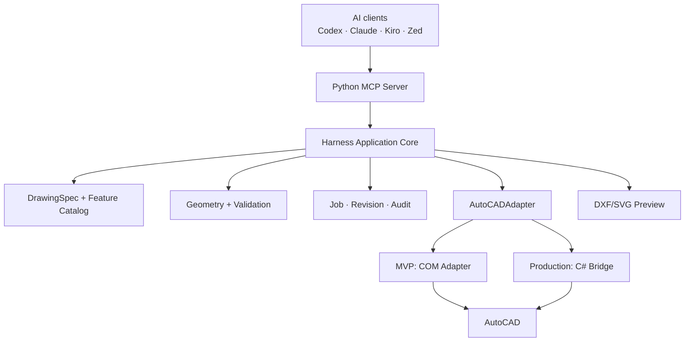
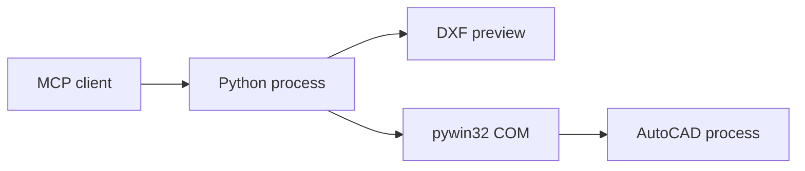
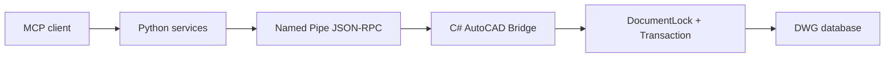
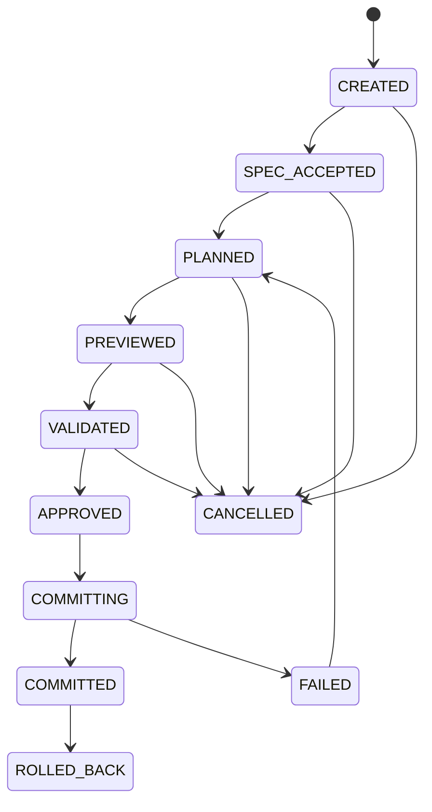
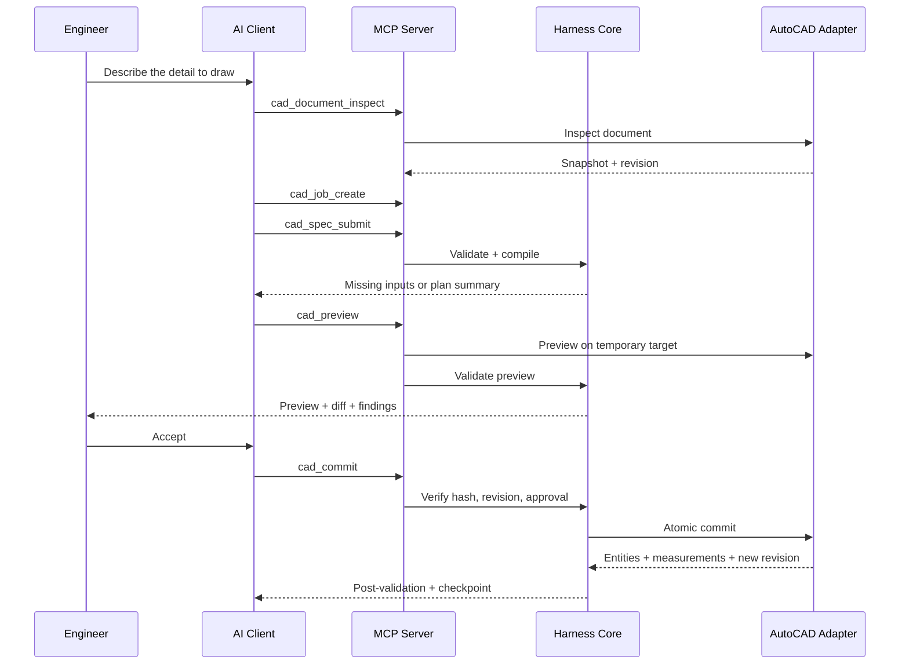

# AutoCAD Mechanical Harness Tool Builder

> Complete system architecture — Python-first, COM MVP, C# Bridge for production

| Attribute | Value |
|---|---|
| Status | Architecture Baseline v1.0 |
| Last updated | 2026-08-02 |
| Initial scope | 2D mechanical fabrication drawings in AutoCAD |
| Primary language | Python 3.12 |
| MVP integration | Python `pywin32`/ActiveX COM |
| Production integration | Small C#/.NET AutoCAD Bridge running inside AutoCAD |
| AI communication | Model Context Protocol (MCP) |
| Target readers | Developers, AI coding agents, mechanical engineers, QA, security reviewers |

---

## 1. Purpose of this document

This document is the authoritative architecture reference so that a developer or an AI coding agent can:

1. Create the repository and packages with the correct boundaries.
2. Build the MVP primarily in Python without depending on C# from the start.
3. Connect Codex, Claude Code, Kiro, or Zed to AutoCAD through MCP.
4. Turn natural-language requirements into verifiable 2D mechanical drawings.
5. Ensure every geometric computation is deterministic, re-measurable, and auditable.
6. Preview, validate, and require engineer approval before modifying a DWG.
7. Replace the COM adapter with a C# Bridge later without rewriting the domain core.

This document describes the target architecture and the migration path from MVP to production. It is not a prompt for an LLM to draw directly in AutoCAD on its own.

---

## 2. Architecture decision summary

### 2.1 Main decision

> Build 90–95% of the system in Python. Use a COM adapter to prove the MVP. Once the workflow is stable, add a small C# AutoCAD Bridge to get transactions, document locking, rollback, and a better in-AutoCAD UI.

### 2.2 Responsibility split

| Component | Responsibility |
|---|---|
| AI client/LLM | Understand intent, choose features, fill schemas, ask for missing data, explain results |
| Python MCP Server | Expose high-level tools, authenticate requests, authorize, return structured results |
| Python Harness Core | Manage jobs, revisions, approvals, orchestration, idempotency, audit |
| Python Mechanical Kernel | Compute coordinates, patterns, offsets, intersections, and feature geometry with deterministic formulas |
| Validation Engine | Measure and check geometry, drawing standards, annotations, feature constraints |
| Preview/Diff Engine | Generate temporary DXF/SVG/PNG and a before/after semantic diff |
| COM Adapter | Connect to AutoCAD for the MVP via ActiveX; contains no business logic |
| C# Bridge | Production adapter inside the AutoCAD process: locks, transactions, undo, metadata, Palette |
| Engineer | Approve assumptions, previews, warnings, and decide commit/rollback |

### 2.3 Choices deliberately not used in the MVP

- Do not write the entire system in C++/ObjectARX.
- Do not expose primitive MCP tools like `draw_line`, `trim`, `offset` to the LLM.
- Do not let the LLM decide intersections, pattern coordinates, or final tolerances.
- Do not use `SendCommand` for critical write operations.
- Do not commit without preview, validation, and approval.
- Do not use implicit numeric defaults.
- Do not send the entire DWG or all geometry to the model when it is not needed.

---

## 3. Product scope

### 3.1 MVP scope

- AutoCAD on Windows.
- 2D mechanical drawings.
- One active document at a time per bridge instance.
- Initial features:
  - Rectangular plate/base plate.
  - Flange.
  - Bolt-circle pattern.
  - Rectangular hole pattern.
  - 2D slot/keyway.
  - 2D L-bracket.
- Basic entities:
  - Line, polyline, circle, arc.
  - Centerline, centermark.
  - Linear, aligned, angular, diameter, and radius dimensions.
  - Limited text/MText.
- Company layer/dimstyle/textstyle mapping.
- ISO 2768 general tolerance as a versioned company profile.
- DXF/SVG/PNG preview.
- Geometric and standards validation.
- Commit with confirmation.
- DXF/PDF export.
- Audit and checkpoints.

### 3.2 Out of MVP scope

- 3D solids, assemblies, sheet-metal unfolding.
- A full parametric constraint graph.
- Custom ObjectARX entities.
- CAM/toolpaths.
- FEA, simulation, or automatic tolerance stack-up certification.
- Complex raster/PDF drawing recognition.
- Cloud batch processing via the Autodesk Automation API.
- Automatic release of production drawings without a human.

### 3.3 Data that must be finalized before the pilot

The following three data groups must not be guessed:

1. The AutoCAD version the company actually uses.
2. The set of DWT/DWS, layers, dimstyles, title block, and plot profiles.
3. The standard/tolerance profile: ISO, ASME, JIS, or an internal standard.

If these are not available, the system runs only with `demo-profile` and must not be labeled "company approved."

---

## 4. Invariant principles

The following principles apply to every phase:

1. **The LLM is not the geometry kernel.** The LLM produces a `DrawingSpec`; the kernel produces geometry.
2. **No silent defaults.** Every default must have a value, source, version, and impact.
3. **Read before write.** Inspect the document and capture the revision before planning a job.
4. **Preview before commit.** The real drawing must not be modified during the preview step.
5. **Validate before and after commit.** Written results must be read back and re-measured.
6. **Optimistic concurrency.** A wrong `expected_revision` rejects the commit.
7. **Idempotent retry.** The same `idempotency_key` must not create duplicate entities.
8. **Atomic job.** Either all operations succeed, or the whole thing rolls back/aborts.
9. **Least privilege.** Read tools and write tools are separate; destructive actions require approval.
10. **Stable identity.** Features use `feature_id`; do not identify only by ObjectId or coordinates.
11. **Versioned contracts.** Spec, plan, result, and company profile all carry a version.
12. **Deterministic output.** The same normalized input and the same profile must produce the same semantic geometry.

---

## 5. Overall architecture



### 5.1 Dependency rule

Dependencies only point inward:

```text
MCP / CLI / UI
    -> Application Services
        -> Domain Models + Ports
            -> Geometry / Validation Pure Core

Infrastructure adapters implement Domain Ports.
Domain Core must not import MCP, COM, AutoCAD, SQLite or UI packages.
```

### 5.2 Logical layers

| Layer | May depend on | Must not depend on |
|---|---|---|
| Domain | Python stdlib, internal math types | MCP, COM, AutoCAD, database, GUI |
| Application | Domain ports/models | COM implementation, specific UI |
| Infrastructure | Application ports, external SDKs | New business decisions |
| Interface | Application services | Direct geometry formulas |

---

## 6. Two deployment modes

### 6.1 Mode A — Python-only MVP



Characteristics:

- Fast to develop and demo.
- Preview on temporary files.
- COM uses only the object API.
- Uses undo marks when the API supports them, plus file checkpoints and an operation journal.
- Post-commit validation is mandatory.
- Does not guarantee atomicity equivalent to AutoCAD .NET transactions for complex jobs.

### 6.2 Mode B — Production Bridge



Characteristics:

- The C# Bridge runs inside AutoCAD.
- Local IPC over a Windows Named Pipe with an ACL.
- Requests are routed to the correct AutoCAD command/document context.
- Each commit runs inside a transaction and an undo group.
- Can use transient graphics and a PaletteSet.
- The Python domain core is unchanged.

### 6.3 Conditions for upgrading from COM to C#

Upgrade when one of the following holds:

- The pilot is used on real drawings.
- A single job frequently creates/modifies many related entities.
- COM "AutoCAD is busy" degrades the experience.
- Reliable atomic transactions and document locking are needed.
- In-viewport preview is needed.
- PaletteSet, reactors, or deep metadata are needed.

---

## 7. Component detail

### 7.1 Python MCP Server

Responsibilities:

- Run STDIO as the compatibility baseline.
- May add Streamable HTTP for centrally managed environments.
- Declare `inputSchema` and `outputSchema` clearly.
- Expose only high-level tools.
- Map internal exceptions to actionable error codes.
- Enforce read/write/destructive permissions.
- Contain no mechanical formulas.

Rules:

- Every job-related tool must accept an explicit `job_id`.
- Every write tool must accept an `idempotency_key`.
- `cad_commit` must accept `expected_revision`, `plan_hash`, and `approval_token`.
- The structured result is the source of truth; text is only an explanation.
- Tools must not rely on hidden conversational state.

### 7.2 Harness Application Core

Main services:

```text
DocumentInspectionService
JobService
SpecificationService
PlanCompilerService
PreviewService
ValidationService
ApprovalService
CommitService
RollbackService
ExportService
AuditService
```

Responsibilities:

- Drive the state machine.
- Check preconditions.
- Call feature compilers.
- Produce the plan hash.
- Select the adapter per configuration.
- Manage retry and idempotency.
- Block commits when there is a blocking error.

### 7.3 DrawingSpec and Feature Catalog

`DrawingSpec` describes **engineering meaning**, not a sequence of clicks or AutoCAD commands.

Each feature compiler:

- Accepts typed parameters.
- Checks required inputs.
- Applies explicit defaults from the profile when permitted.
- Produces intermediate operations.
- Produces constraint/measurement expectations.
- Does not call AutoCAD directly.

Conceptual interface:

```python
from typing import Protocol


class FeatureCompiler(Protocol):
    feature_type: str
    schema_version: str

    def validate_inputs(
        self, feature: "FeatureSpec", context: "CompileContext"
    ) -> "InputReport": ...

    def compile(self, feature: "FeatureSpec", context: "CompileContext") -> "CompiledFeature": ...
```

### 7.4 Mechanical Geometry Kernel

Responsibilities:

- 2D point/vector/line/arc/circle/polyline.
- Unit normalization.
- Intersection, offset, projection.
- Fillet/chamfer calculation.
- Bolt circle and rectangular patterns.
- Slot/keyway geometry.
- Bounding box and containment.
- Distance and angle measurement.
- Tolerance-aware predicates.

Rules:

- The MVP internal canonical unit is the millimetre.
- Never compare floats directly with `==` for geometry.
- Every predicate uses a `ToleranceProfile`.
- Prefer pure functions whenever possible.
- Do not depend on Shapely for rules that can be implemented clearly and need auditing; Shapely may assist, but important results must be wrapped, checked, and tested.

### 7.5 Validation Engine

The pipeline consists of:

1. Schema validation.
2. Semantic input validation.
3. Plan validation.
4. Preview geometry validation.
5. Company standard validation.
6. Pre-commit gate.
7. Post-commit measurement validation.

Each finding has:

- `rule_id`.
- `severity`: `info`, `warning`, `error`, `blocking`.
- `feature_id` or `entity_ref`.
- Expected/actual/tolerance.
- Technical message.
- Suggested fix.
- Evidence/measurement.

### 7.6 Preview and semantic diff

Preview is not merely a fake screenshot. It includes:

- A temporary DXF file.
- SVG/PNG for a quick human view.
- `semantic_diff.json`.
- A validation report.
- The plan hash.

Color convention:

- Green: new entities.
- Yellow: modified entities.
- Red: entities expected to be deleted.
- Purple: standard violations.

Pass/fail must be based on measurements and semantic rules, not on computer vision.

### 7.7 Job store and audit

The MVP uses SQLite on the local workstation. Production may move to PostgreSQL if multiple workstations need to share jobs.

Stored data:

- Job state.
- Document fingerprint/revision.
- Normalized spec.
- Operation plan.
- Plan hash.
- Preview artifact metadata.
- Validation findings.
- Approval record.
- Commit result.
- Entity mapping.
- Append-only audit events.

Do not store full prompts in telemetry by default.

### 7.8 AutoCADAdapter port

```python
from typing import Protocol


class AutoCADAdapter(Protocol):
    def status(self) -> "AdapterStatus": ...

    def inspect_document(self, request: "InspectRequest") -> "DocumentSnapshot": ...

    def inspect_selection(self, request: "SelectionRequest") -> "SelectionSnapshot": ...

    def preview(self, plan: "OperationPlan") -> "PreviewResult": ...

    def validate_revision(self, document_id: str, expected_revision: str) -> bool: ...

    def commit(self, request: "CommitRequest") -> "CommitResult": ...

    def rollback(self, request: "RollbackRequest") -> "RollbackResult": ...

    def export(self, request: "ExportRequest") -> "ExportResult": ...
```

The business layer only knows this interface.

---

## 8. Domain model

### 8.1 Main aggregates

| Model | Meaning |
|---|---|
| `DocumentSnapshot` | Document state at inspection time |
| `DrawingSpec` | Normalized engineering requirement |
| `FeatureSpec` | A mechanical feature with typed parameters |
| `OperationPlan` | A deterministic list of operations for the adapter to execute |
| `ValidationReport` | The result of all validation rules |
| `CadJob` | Aggregate managing the entire change lifecycle |
| `ApprovalRecord` | Who approved, which plan, under what conditions |
| `CommitResult` | Actual entities, measurements, and the revision after commit |
| `Checkpoint` | A point that can be rolled back/restored |

### 8.2 Job state machine



State transition rules:

- `SPEC_ACCEPTED` only when there are no missing required inputs.
- `PLANNED` only when deterministic compilation succeeds.
- `PREVIEWED` must be tied to the correct `plan_hash`.
- `VALIDATED` only when the report has no `blocking` findings.
- `APPROVED` applies only to the exact `plan_hash` and `expected_revision`.
- Any change to spec/plan after approval invalidates that approval.
- `COMMITTING` must hold the writer lease for the document.

### 8.3 Feature identity

Each feature has a stable ID, for example:

```text
feature:base-plate-001
feature:base-plate-001:outline
feature:base-plate-001:hole-pattern
feature:base-plate-001:dimension-width
```

The MVP stores mappings in the job store and in XData if COM allows them to be stable. The production Bridge stores them in XData or an Extension Dictionary under a dedicated application registry.

---

## 9. End-to-end workflow



### 9.1 Happy path

1. Inspect the document and selection.
2. Create a `CadJob` with `expected_revision`.
3. Submit the `DrawingSpec`.
4. If data is missing, return `missing_inputs`; do not compile further.
5. Compile the spec into a canonical `OperationPlan`.
6. Hash the plan.
7. Generate a preview outside the real DWG.
8. Run validation.
9. The engineer approves the exact preview/hash.
10. Re-check the document revision.
11. Hold the writer lease.
12. Commit.
13. Read back new entities and re-measure.
14. On failure: abort/undo per adapter capability.
15. On pass: create a checkpoint, a new revision, and an audit event.

### 9.2 Missing input path

Example request:

> Draw an Ø160 flange, 12 thick, 8 Ø14 holes on PCD120.

If there is no center, the system returns:

```json
{
  "status": "needs_input",
  "error_code": "MISSING_REQUIRED_INPUTS",
  "missing_inputs": [
    {
      "path": "features[0].center_mm",
      "reason": "Center/datum is required to place the flange",
      "accepted_formats": ["[x, y]", "selected_point", "named_datum"]
    }
  ]
}
```

Must not silently use `[0, 0]` unless the profile explicitly declares it an allowed default.

### 9.3 Stale revision path

If the drawing changed after the preview:

```json
{
  "status": "rejected",
  "error_code": "STALE_DOCUMENT_REVISION",
  "expected_revision": "sha256:...old...",
  "actual_revision": "sha256:...new...",
  "required_action": "Re-inspect, regenerate preview, validate and request approval again"
}
```

---

## 10. MCP tool surface

Only 13 high-level tools are exposed:

| Tool | Side effect | Approval | Purpose |
|---|---|---|---|
| `cad_status` | None | No | Check server, adapter, AutoCAD, and capability |
| `cad_document_inspect` | None | No | Read document metadata, standards, revision |
| `cad_selection_inspect` | None | No | Read a scoped selection |
| `cad_feature_catalog_search` | None | No | Find supported features and schemas |
| `cad_job_create` | Internal DB only | No | Create a job and pin the input revision |
| `cad_spec_submit` | Internal DB only | No | Validate and normalize a DrawingSpec |
| `cad_change_submit` | Internal DB only | No | Change a spec with versioning |
| `cad_preview` | Temporary files | May be auto | Generate a preview and semantic diff |
| `cad_validate` | No DWG change | No | Run validation per stage |
| `cad_diff_get` | None | No | Get the semantic diff and artifact refs |
| `cad_commit` | Modifies DWG | Required | Commit an approved plan |
| `cad_rollback` | Destructive | Required | Return to a checkpoint/undo group |
| `cad_export` | Writes files | Required per policy | Export DWG/DXF/PDF |

### 10.1 Common tool contract

Every request may contain:

```json
{
  "request_id": "req_01J...",
  "schema_version": "1.0",
  "client": {
    "name": "codex",
    "version": "unknown"
  }
}
```

Every response uses the envelope:

```json
{
  "status": "ok",
  "request_id": "req_01J...",
  "job_id": "job_01J...",
  "data": {},
  "warnings": [],
  "audit_event_id": "evt_01J..."
}
```

Standard statuses:

- `ok`
- `needs_input`
- `rejected`
- `conflict`
- `failed`
- `partial` used only for read/export batches; never for an atomic commit.

---

## 11. Data contracts

The main schemas live in `contracts/` and are generated from Pydantic where appropriate. JSON Schema is validated at both the MCP boundary and the adapter boundary.

### 11.1 DrawingSpec example

```json
{
  "schema_version": "1.0",
  "spec_id": "spec_01J...",
  "document_id": "doc_01J...",
  "units": "mm",
  "standard_profile": {
    "profile_id": "company-mechanical-2d",
    "version": "3.0"
  },
  "drawing": {
    "projection": "orthographic",
    "view": "top",
    "datum": {
      "type": "point",
      "point_mm": [0.0, 0.0]
    }
  },
  "features": [
    {
      "feature_id": "base-plate-001",
      "type": "rectangular_plate",
      "parameters": {
        "width_mm": 160.0,
        "height_mm": 100.0,
        "thickness_mm": 12.0,
        "material": "SS400",
        "origin_mm": [0.0, 0.0]
      },
      "children": [
        {
          "feature_id": "base-plate-001-holes",
          "type": "rectangular_hole_pattern",
          "parameters": {
            "hole_diameter_mm": 14.0,
            "edge_offset_x_mm": 20.0,
            "edge_offset_y_mm": 20.0,
            "count_x": 2,
            "count_y": 2
          }
        }
      ]
    }
  ],
  "annotations": {
    "general_tolerance": "ISO 2768-m",
    "dimensions": "auto_required",
    "title_block": "company_a3_landscape"
  },
  "assumptions": [],
  "explicit_defaults": [
    {
      "path": "annotations.dimension_style",
      "value": "COMPANY-ISO-MM",
      "source": "company-mechanical-2d@3.0",
      "impact": "Controls text height, arrows and precision"
    }
  ]
}
```

### 11.2 OperationPlan example

```json
{
  "schema_version": "1.0",
  "plan_id": "plan_01J...",
  "job_id": "job_01J...",
  "document_id": "doc_01J...",
  "expected_revision": "sha256:document-revision",
  "canonical_units": "mm",
  "profile_ref": "company-mechanical-2d@3.0",
  "operations": [
    {
      "operation_id": "op-outline",
      "feature_id": "base-plate-001",
      "type": "create_closed_polyline",
      "layer": "OBJECT",
      "geometry": {
        "vertices_mm": [[0, 0], [160, 0], [160, 100], [0, 100]]
      },
      "expected": {
        "closed": true,
        "area_mm2": 16000.0
      }
    },
    {
      "operation_id": "op-holes",
      "feature_id": "base-plate-001-holes",
      "type": "create_circles",
      "layer": "OBJECT",
      "geometry": {
        "centers_mm": [[20, 20], [140, 20], [20, 80], [140, 80]],
        "diameter_mm": 14.0
      },
      "expected": {
        "count": 4,
        "minimum_edge_distance_mm": 13.0
      }
    }
  ],
  "validation_expectations": [],
  "plan_hash": "sha256:canonical-json-hash"
}
```

### 11.3 OperationResult example

```json
{
  "schema_version": "1.0",
  "job_id": "job_01J...",
  "plan_hash": "sha256:canonical-json-hash",
  "status": "committed",
  "entity_results": [
    {
      "operation_id": "op-outline",
      "feature_id": "base-plate-001",
      "entity_ref": "acad:handle:2AF",
      "entity_type": "AcDbPolyline",
      "measurements": {
        "closed": true,
        "area_mm2": 16000.0
      }
    }
  ],
  "previous_revision": "sha256:old",
  "new_revision": "sha256:new",
  "checkpoint_id": "checkpoint_01J..."
}
```

### 11.4 Contract versioning

- Semantic versioning for schemas.
- A minor version only adds optional fields.
- A major version when meaning changes or a field is removed.
- The server supports at least the current major and the previous major during migration.
- The adapter rejects unknown major versions.
- Do not hash unknown fields; canonicalization must follow the schema version.

---

## 12. Defaults, assumptions, and provenance

### 12.1 Input classification

| Type | Example | Handling |
|---|---|---|
| Required engineering input | Dimensions, datum, PCD, hole diameter | Missing means stop and ask |
| Profile default | Layer, dimstyle, text height | May apply but must disclose source/version |
| Derived value | Coordinates of each hole | Kernel computes; do not ask the user when the formula has enough data |
| Assumption | Choosing top view from a vague description | Must be stated and needs approval if it affects geometry |
| Presentation preference | Preview color | May use app preferences; does not affect geometry |

### 12.2 Default record

```json
{
  "path": "annotations.dimension_style",
  "value": "COMPANY-ISO-MM",
  "source": "company-profile",
  "source_version": "3.0",
  "reason": "Required by drawing standard",
  "impact": "Annotation formatting only",
  "override_allowed": true
}
```

### 12.3 Blocking rule

Defaults must not be applied to:

- Feature size.
- Datum/origin that affects placement.
- Hole count/diameter/PCD.
- Material when it affects annotation/BOM.
- Tolerance class.
- Projection/view orientation.
- Units when the document is not clearly defined.

Unless the company profile has an explicit, versioned rule and the user has selected that profile.

---

## 13. Revision, hashing, and concurrency

### 13.1 Document identity

`document_id` is the stable identity of the session/file, not simply the filename.

Sources may include:

- Full normalized path hash.
- AutoCAD database fingerprint GUID if available.
- Session instance ID.
- File metadata.

Do not put raw sensitive paths into tool results by default.

### 13.2 Revision fingerprint

The revision is not just the file modification time. It should hash a canonical snapshot including:

- Database/file fingerprint.
- Relevant entity handles and geometric digest.
- Relevant layer/style digest.
- Current space/layout.
- Units/UCS metadata.
- Internal harness revision counter.

The MVP may use a coarse revision; the production Bridge must provide a more reliable revision.

### 13.3 Plan hash

`plan_hash = SHA-256(canonical_json(OperationPlan_without_plan_hash))`

Canonical JSON requires:

- UTF-8.
- Fixed key sorting.
- No unnecessary whitespace.
- Numbers normalized per precision policy.
- Arrays keep their semantic order.
- No hashing of timestamps, trace IDs, or fields that do not affect the plan.

### 13.4 Writer lease

- At most one writer per `document_id`.
- The lease has an owner, creation time, expiry, and heartbeat.
- The commit holds the lease for the shortest time possible.
- An expired lease does not mean the previous commit surely failed; reconcile adapter state before retrying.

---

## 14. Idempotency and retry

### 14.1 Idempotency key

Each write operation records:

```text
idempotency_key = client-generated stable key
scope = document_id + tool_name
request_digest = hash(normalized request)
```

Rules:

- Same key + same digest: return the previous result or the in-progress status.
- Same key + different digest: return `IDEMPOTENCY_KEY_REUSED`.
- Do not auto-retry a commit if it is unknown whether the previous one committed.
- Reconcile using job status, entity mapping, and revision before continuing.

### 14.2 Retry policy

| Error | Auto retry |
|---|---|
| Validation error | No |
| Stale revision | No |
| Missing input | No |
| AutoCAD busy before the transaction started | Yes, bounded exponential backoff |
| IPC disconnect before the request was sent | Yes |
| IPC disconnect with unknown commit outcome | No; switch to `UNKNOWN_COMMIT_STATE` and reconcile |
| SQLite busy | Yes, bounded |

---

## 15. Validation rules

### 15.1 Geometry

- Zero-length entities.
- Non-finite coordinates (`NaN`, `Infinity`).
- Polyline not closed when expected closed.
- Self-intersecting polyline.
- Coincident points outside the tolerance policy.
- Invalid arc/circle radius.
- Non-tangent fillet.
- Chamfer with wrong distance/angle.
- Duplicate or overlapping entities.
- Hole outside the part boundary.
- Hole-edge distance below minimum.
- Hole-hole distance below minimum.
- Pattern with wrong count, pitch, PCD, or angle.
- Failed parallel/perpendicular/tangent/coincident constraints.
- Expected area/perimeter/extents mismatch.
- Dimension text/value not matching the actual measurement.

### 15.2 Drawing standard

- Units.
- Layer name/color/lineweight/linetype.
- Objects placed on the correct layer.
- Dimstyle/textstyle.
- Annotation scale.
- Centerline/hidden-line convention.
- Title block and required attributes.
- Layout/viewport/plot scale.
- Plot configuration.
- DWT/DWS alignment.
- Standard profile version.

### 15.3 Feature-specific

Example `rectangular_plate`:

- Width/height/thickness > 0.
- Outline has 4 orthogonal edges.
- Measured width/height within tolerance.
- Child holes lie inside the outline.
- Edge distance satisfies the rule.

Example `flange`:

- Outside diameter > PCD + hole diameter + 2 × minimum ligament.
- Hole count is a positive integer.
- Hole centers lie on the PCD within tolerance.
- Angular spacing equals `360 / count` within tolerance.

### 15.4 Tolerance profile

```yaml
tolerance_profile:
  id: mechanical-mm-default
  version: "1.0"
  canonical_unit: mm
  absolute_length_mm: 0.001
  relative_length: 1.0e-9
  angular_deg: 0.0001
  coincidence_mm: 0.001
  area_mm2: 0.01
```

The values above are only a **demo configuration**, not a company-approved tolerance.

### 15.5 Validation gate

| Severity | Preview | Commit |
|---|---|---|
| Info | Allowed | Allowed |
| Warning | Allowed | Must be shown in approval |
| Error | Allowed for preview | Blocks commit under the default policy |
| Blocking | Blocks the next stage | Always blocks |

---

## 16. AutoCAD integration

### 16.1 COM Adapter for the MVP

Principles:

- Runs on Windows in the same user session as AutoCAD.
- Uses the `pywin32`/ActiveX object model.
- No shell, scripts, or arbitrary AutoLISP.
- No `SendCommand` for business operations.
- Each COM call has a timeout/cancellation boundary at the orchestration layer.
- Detect AutoCAD busy and return a clear error.
- Create entities in operation-plan order.
- Attach feature metadata if the ActiveX surface allows; always keep an external mapping in SQLite.
- Read back properties/measurements after creation.
- Use a checkpoint copy before an important commit.
- Use undo marks when possible, but do not claim transaction guarantees equivalent to the .NET API.

The COM adapter must be thin:

```text
OperationPlan
  -> map operation type
  -> create/update/delete AutoCAD entity
  -> return handles and measurements
```

Do not put in the COM adapter:

- Bolt-circle formulas.
- Layer decisions per company standard.
- Missing-input logic.
- Approval logic.
- Validation business rules.

### 16.2 C# Bridge for production

The C# Bridge only needs these modules:

```text
CadBridge.Plugin
CadBridge.Ipc
CadBridge.Execution
CadBridge.Inspection
CadBridge.Metadata
CadBridge.Palette        # optional after core bridge
CadBridge.Contracts
```

Mandatory responsibilities:

- Named Pipe server with a Windows ACL.
- Validate schema and request size.
- Move execution into the AutoCAD command context.
- Select the correct document.
- `DocumentLock` before writes.
- A transaction for the whole job.
- Abort if any operation fails.
- An undo group for the commit.
- Stable metadata.
- Read-back measurement before returning success.
- Never let exceptions escape the boundary.

Pseudo-flow:

```text
receive request
-> authenticate local client
-> validate contract/version
-> enqueue into AutoCAD context
-> verify document + revision
-> acquire document lock
-> begin undo group
-> begin transaction
-> execute all operations
-> measure and validate adapter invariants
-> commit transaction
-> end undo group
-> compute new revision
-> return result
```

If an error occurs before the transaction commits: abort. If an error occurs after the commit but before the response: mark the outcome as needing reconciliation using job/idempotency data.

### 16.3 IPC contract

- Transport: local-only Windows Named Pipe.
- Encoding: UTF-8 JSON.
- Framing: length-prefixed messages.
- Configurable max request/response size.
- Correlation: `request_id`, `job_id`, `idempotency_key`.
- Separate timeouts for inspect, preview, commit, and export.
- Protocol handshake returns capability and supported schema versions.
- Do not deserialize arbitrary polymorphic types.
- Do not let the client send .NET type names.

---

## 17. Security architecture

### 17.1 Main threat model

- Prompt injection requesting write/delete tools outside intent.
- The LLM generating plausible-looking but wrong geometry.
- A stale preview committed onto a newer document.
- Retries creating duplicate entities.
- Another client seizing the writer.
- Unauthorized Named Pipe clients.
- Export overwriting critical files.
- Sensitive drawing data sent to a cloud model.
- Audit containing prompts or sensitive paths.
- Arbitrary command execution through AutoCAD.

### 17.2 Controls

- Tool allowlist per client/profile.
- Separated read/write/destructive scopes.
- Short-lived approval token bound to `job_id`, `plan_hash`, `revision`.
- Path allowlist for preview/export/checkpoint.
- No overwrite by default.
- Named Pipe ACL only for the permitted user/service account.
- Code signing for production plug-ins/installers.
- Request size/depth limits.
- JSON Schema validation on both ends.
- No `eval`, shell, AutoLISP, or arbitrary `SendCommand`.
- Selection-scoped inspection by default.
- Redaction of path/project/customer metadata.
- Append-only audit with hash chaining per compliance level.
- Local-only mode.

### 17.3 Approval token

An approval must contain at minimum:

```json
{
  "approval_id": "approval_01J...",
  "job_id": "job_01J...",
  "document_id": "doc_01J...",
  "expected_revision": "sha256:...",
  "plan_hash": "sha256:...",
  "approved_by": "user-or-engineer-id",
  "approved_at": "2026-08-02T00:00:00Z",
  "expires_at": "2026-08-02T00:15:00Z",
  "warnings_acknowledged": ["RULE-ID"]
}
```

Changing the plan or revision invalidates the token.

### 17.4 Data minimization

MCP responses prioritize:

- Document metadata.
- Feature summary.
- Selection geometry the user permitted.
- Necessary measurements.
- Internal artifact references.

Do not return the entire entity database unless the tool requires it.

---

## 18. Persistence model

Logical SQLite schema:

```text
documents
  document_id PK
  path_hash
  fingerprint
  current_revision
  last_seen_at

jobs
  job_id PK
  document_id FK
  state
  expected_revision
  current_spec_version
  plan_hash
  created_at
  updated_at

spec_versions
  spec_version_id PK
  job_id FK
  schema_version
  normalized_json
  content_hash
  created_at

plans
  plan_id PK
  job_id FK
  schema_version
  plan_json
  plan_hash UNIQUE
  created_at

validations
  validation_id PK
  job_id FK
  stage
  plan_hash
  report_json
  blocking_count
  created_at

approvals
  approval_id PK
  job_id FK
  plan_hash
  expected_revision
  approved_by
  expires_at

executions
  execution_id PK
  job_id FK
  idempotency_key
  request_digest
  status
  result_json
  started_at
  completed_at

entity_mappings
  document_id
  feature_id
  operation_id
  entity_ref
  last_revision

checkpoints
  checkpoint_id PK
  job_id FK
  revision
  artifact_ref
  created_at

audit_events
  event_id PK
  job_id
  event_type
  actor_type
  actor_id
  payload_redacted_json
  previous_event_hash
  event_hash
  created_at
```

### 18.1 Migration

- Alembic manages database migrations.
- Do not edit the schema manually on a pilot machine.
- Each release backs up before migrating.
- A downgrade migration is used only if data has been tested.

### 18.2 Retention

- Job metadata: per company policy.
- Temporary previews: short TTL, e.g. 7–30 days.
- Audit: longer retention and append-only.
- Full drawing checkpoints: stored only in permitted directories; with quota and encryption policy.

---

## 19. Engineer UI

### 19.1 MVP UI

May use a PySide6 desktop window or a CLI plus file preview. At minimum it must show:

- Active document and revision.
- Job state.
- Spec parameters.
- Missing input.
- Defaults with source/version.
- Assumptions.
- Before/after preview.
- Validation findings.
- `Accept`, `Reject`, `Commit`, `Rollback` per permission.

### 19.2 Production UI

An AutoCAD PaletteSet from the C# Bridge:

- Tracks the active document.
- Highlights features/entities per finding.
- Does not block the command loop for long.
- Approval must be bound to the plan hash.
- Shows revision conflicts as soon as the document changes.

The AI client does not replace the Palette. The Palette is the stable approval surface regardless of whether Codex, Claude Code, Kiro, or Zed is used.

---

## 20. Error model

### 20.1 Minimum error codes

```text
MISSING_REQUIRED_INPUTS
UNSUPPORTED_SCHEMA_VERSION
UNSUPPORTED_FEATURE
INVALID_FEATURE_PARAMETERS
INVALID_GEOMETRY
STANDARD_PROFILE_NOT_FOUND
STANDARD_VIOLATION
DOCUMENT_NOT_FOUND
DOCUMENT_NOT_ACTIVE
STALE_DOCUMENT_REVISION
PLAN_HASH_MISMATCH
APPROVAL_REQUIRED
APPROVAL_EXPIRED
APPROVAL_SCOPE_MISMATCH
WRITER_LEASE_CONFLICT
IDEMPOTENCY_KEY_REUSED
AUTOCAD_NOT_RUNNING
AUTOCAD_BUSY
ADAPTER_CAPABILITY_MISSING
IPC_TIMEOUT
COM_CALL_FAILED
TRANSACTION_ABORTED
POST_COMMIT_VALIDATION_FAILED
UNKNOWN_COMMIT_STATE
EXPORT_PATH_NOT_ALLOWED
ROLLBACK_NOT_AVAILABLE
INTERNAL_ERROR
```

### 20.2 Actionable error

```json
{
  "status": "rejected",
  "error": {
    "code": "PLAN_HASH_MISMATCH",
    "message": "The approved preview does not match the submitted commit plan",
    "retryable": false,
    "required_action": "Generate a new preview and request approval",
    "details": {
      "approved_plan_hash": "sha256:a",
      "submitted_plan_hash": "sha256:b"
    }
  }
}
```

Do not expose stack traces or absolute sensitive paths to the MCP client by default.

---

## 21. Observability and audit

### 21.1 Structured logging

Standard log fields:

```text
timestamp
level
service
event_name
request_id
job_id
document_id_pseudonym
plan_hash_prefix
adapter_type
duration_ms
outcome
error_code
```

Do not log:

- Full prompts by default.
- All drawing geometry.
- Raw customer/project paths.
- Approval secrets/tokens.

### 21.2 Metrics

- Job success rate.
- Preview-to-commit conversion.
- Missing-input rate per feature.
- Validation failure rate per rule.
- Post-commit mismatch rate.
- Duplicate prevention count.
- Stale revision rejection count.
- COM busy/error rate.
- Median/P95 preview time.
- Median/P95 commit time.
- Rollback rate.
- Engineer correction rate after an AI-generated spec.

### 21.3 Audit events

```text
DOCUMENT_INSPECTED
JOB_CREATED
SPEC_SUBMITTED
SPEC_CHANGED
PLAN_COMPILED
PREVIEW_GENERATED
VALIDATION_COMPLETED
APPROVAL_GRANTED
APPROVAL_REVOKED
COMMIT_STARTED
COMMIT_SUCCEEDED
COMMIT_FAILED
ROLLBACK_STARTED
ROLLBACK_SUCCEEDED
EXPORT_CREATED
```

---

## 22. Testing strategy

### 22.1 Test pyramid

| Test | Weight | Runs AutoCAD |
|---|---:|---|
| Unit tests for pure geometry/domain | Largest | No |
| Property-based tests | Large | No |
| Contract/schema tests | Large | No |
| Feature compiler tests | Large | No |
| Golden semantic drawing tests | Medium | No/adapter-dependent |
| Adapter integration tests | Medium | Yes |
| End-to-end client tests | Small | Yes |
| Fault injection/recovery | Small but mandatory | Yes |

### 22.2 Unit tests

- Bolt-circle coordinates.
- Rectangular pattern.
- Slot geometry.
- Offset/intersection edge cases.
- Unit conversion.
- Tolerance predicates.
- Canonical JSON and hashing.
- State transitions.
- Default provenance.
- Idempotency conflict.

### 22.3 Property-based tests

Using Hypothesis:

- Rotation/translation does not change intrinsic measurements.
- A bolt-circle point is always PCD/2 from the center within tolerance.
- Pattern count is always correct.
- A closed plate has positive area for valid dimensions.
- Compiling the same normalized spec always yields the same hash.
- Invalid floats never pass through schema/kernel.

### 22.4 Golden drawing tests

Each golden case stores:

```text
input_spec.json
company_profile.yaml
expected_plan.json
expected_semantic_entities.json
expected_validation.json
preview_reference.svg
```

Do not compare DWG byte-for-byte because metadata and serialization can change. Compare semantic entities, measurements, layer/style, and tolerance.

### 22.5 Adapter contract tests

The same suite runs against:

- `DxfPreviewAdapter`.
- `ComAutoCADAdapter`.
- `DotNetBridgeAdapter`.
- `FakeAutoCADAdapter`.

Check output per capability; do not force every adapter to support the same things.

### 22.6 Fault injection

- AutoCAD closes mid-commit.
- Document changes after approval.
- IPC disconnect before/during/after commit.
- COM busy.
- The Nth operation fails.
- SQLite locked.
- Disk full while creating preview/checkpoint.
- Duplicate retry.
- Post-commit measurement mismatch.
- Approval expired.

### 22.7 Client compatibility

Run the same eval suite on Codex, Claude Code, Kiro, and Zed:

- Tool discovery.
- Structured input/output.
- Missing-input recovery.
- Approval behavior.
- Read-only allowlist.
- Error correction.
- Long-running preview/commit progress.

---

## 23. Repository structure

```text
autocad-mechanical-harness/
├── README.md
├── pyproject.toml
├── uv.lock
├── .env.example
├── .gitignore
├── docs/
│   ├── architecture.md
│   ├── security.md
│   ├── operations.md
│   ├── feature-authoring.md
│   └── adr/
├── apps/
│   ├── mcp_server/
│   │   ├── __main__.py
│   │   ├── server.py
│   │   └── tools/
│   ├── cli/
│   └── engineer_desktop/
├── src/
│   └── cad_harness/
│       ├── domain/
│       │   ├── models/
│       │   ├── value_objects/
│       │   ├── errors.py
│       │   └── ports/
│       ├── application/
│       │   ├── services/
│       │   ├── commands/
│       │   └── queries/
│       ├── drawing_specs/
│       ├── feature_catalog/
│       │   ├── registry.py
│       │   ├── plate/
│       │   ├── flange/
│       │   ├── hole_pattern/
│       │   ├── slot/
│       │   └── bracket/
│       ├── geometry/
│       │   ├── primitives.py
│       │   ├── predicates.py
│       │   ├── intersections.py
│       │   ├── patterns.py
│       │   └── tolerance.py
│       ├── validation/
│       │   ├── engine.py
│       │   ├── findings.py
│       │   └── rules/
│       ├── company_rules/
│       │   ├── loader.py
│       │   └── profiles/
│       ├── preview/
│       ├── diff/
│       ├── persistence/
│       ├── security/
│       ├── observability/
│       └── adapters/
│           ├── base.py
│           ├── fake.py
│           ├── dxf_preview.py
│           ├── autocad_com.py
│           └── dotnet_bridge.py
├── contracts/
│   ├── drawing-spec.schema.json
│   ├── operation-plan.schema.json
│   ├── operation-result.schema.json
│   ├── validation-report.schema.json
│   └── ipc-envelope.schema.json
├── dotnet/
│   └── AutoCADBridge/
│       ├── CadBridge.Plugin/
│       ├── CadBridge.Contracts/
│       ├── CadBridge.Execution/
│       ├── CadBridge.Ipc/
│       ├── CadBridge.Tests/
│       └── AutoCADHarness.bundle/
├── tests/
│   ├── unit/
│   ├── property/
│   ├── contract/
│   ├── integration/
│   ├── golden_drawings/
│   ├── compatibility/
│   └── fault_injection/
├── scripts/
│   ├── generate_schemas.py
│   ├── run_golden_tests.py
│   └── package_release.py
└── installer/
```

### 23.1 Python package rules

- Use the `src/` layout.
- Use strict type hints.
- Pydantic at the boundary; the domain may use frozen dataclasses/value objects.
- Ruff for lint/format.
- Mypy or Pyright, strict progressively per package.
- Pytest + Hypothesis.
- Do not import `win32com` outside `adapters/autocad_com.py` and related helpers.

---

## 24. Technology stack

| Item | Technology |
|---|---|
| Primary runtime | Python 3.12 |
| Package/dependency | `uv` + `pyproject.toml` |
| MCP | Official Python MCP SDK/FastMCP-compatible surface |
| Schema | Pydantic v2 + JSON Schema |
| Geometry | Python math core, NumPy; Shapely through a controlled wrapper |
| DXF | ezdxf |
| COM | pywin32 |
| Database | SQLite + SQLAlchemy + Alembic |
| Desktop UI | PySide6, if needed |
| Test | pytest + Hypothesis |
| Logging | structlog or Python structured logging |
| C# Bridge | .NET compatible with the target AutoCAD version |
| IPC | Windows Named Pipe |

Specific versions must be pinned in the lockfile and re-confirmed against the actual AutoCAD version before release.

---

## 25. Configuration

Example `config/base.yaml`:

```yaml
app:
  environment: development
  local_only: true

mcp:
  transport: stdio
  protocol_compatibility_baseline: "2025-11-25"
  enable_newer_protocol_by_feature_flag: true

adapter:
  type: com
  autocad_prog_id: AutoCAD.Application
  inspect_timeout_seconds: 15
  commit_timeout_seconds: 120

storage:
  sqlite_path: ./data/harness.db
  preview_directory: ./data/previews
  checkpoint_directory: ./data/checkpoints

security:
  require_commit_approval: true
  # Rollback approval is mandatory and cannot be disabled by configuration.
  allow_arbitrary_export_path: false
  redact_document_paths: true

geometry:
  canonical_unit: mm
  tolerance_profile: demo-mechanical-mm@1.0

standards:
  company_profile: demo-profile@1.0
```

Do not commit secrets, user paths, or company-confidential profiles into a public repository.

---

## 26. Build and deployment

### 26.1 Development

```text
Python virtual environment
-> install locked dependencies
-> migrate SQLite
-> run unit/contract tests
-> run MCP server in STDIO
-> connect test client
-> use Fake/DXF adapter by default
```

COM integration only runs on Windows with AutoCAD and is marked as an integration test.

### 26.2 MVP release

Includes:

- Python runtime/package.
- MCP server launcher.
- Config templates.
- SQLite migrations.
- Demo company profile.
- COM adapter.
- Minimal CLI/desktop approval UI.
- Signed checksums.
- Installation and rollback guide.

### 26.3 Production release

Adds:

- C# AutoCAD plug-in `.bundle`.
- `PackageContents.xml` for the target AutoCAD version.
- Code signing.
- Named Pipe ACL installer.
- Version compatibility matrix.
- Health check.
- Crash recovery/checkpoint policy.

Do not try to ship a single DLL for every AutoCAD version if the runtime/API is incompatible.

---

## 27. Implementation roadmap

### Phase 0 — Discovery, 1–2 weeks

Deliverables:

- AutoCAD version matrix.
- Choose the 2D-only MVP.
- Collect DWT/DWS/standards.
- 30–50 golden drawings.
- List of the first 5 features.
- Threat model and data classification.

Exit criteria:

- Each golden drawing has a desired input spec and key measurements.
- Domain engineers approve the feature definitions.

### Phase 1 — Pure Python Core, 2–3 weeks

Deliverables:

- Repository skeleton.
- Pydantic contracts.
- Job state machine.
- Geometry primitives/tolerance.
- Five feature compilers.
- Validation rule framework.
- Fake adapter.
- Unit/property tests.

Exit criteria:

- Deterministic compilation.
- No AutoCAD needed to run tests.
- The same spec produces the same plan hash.

### Phase 2 — Preview + MCP, 2–3 weeks

Deliverables:

- MCP server.
- 13 tool contracts.
- DXF/SVG preview.
- Semantic diff.
- SQLite/audit.
- Missing-input workflow.
- Approval record.

Exit criteria:

- An AI client can create a job, submit a spec, preview, and validate.
- No tool modifies a real DWG without approval.

### Phase 3 — COM MVP, 2–3 weeks

Deliverables:

- Document/selection inspect.
- Entity create/update mapping.
- Revision checking.
- Checkpoint and undo mark.
- Post-commit measurement.
- Export.

Exit criteria:

- 20–30 golden cases commit successfully.
- Retries create no duplicates.
- Stale revisions are rejected.

### Phase 4 — Hardening + Pilot, 3–5 weeks

Deliverables:

- Fault injection.
- Installer.
- Security controls.
- Client compatibility suite.
- Metrics/dashboard.
- Pilot with 5–10 engineers.

Exit criteria:

- No blocking safety issues.
- Post-commit mismatch rate meets the agreed pilot threshold.
- Engineers understand preview, defaults, and warnings.

### Phase 5 — C# Bridge, after the MVP proves value

Deliverables:

- Named Pipe contract.
- AutoCAD command-context execution.
- `DocumentLock` + transaction.
- Atomic abort.
- Stable metadata.
- Minimal PaletteSet.
- Bundle installer.

Exit criteria:

- The same adapter contract suite passes.
- The Python core does not change its public contract.
- A failure between operations leaves no partial geometry.

---

## 28. Acceptance criteria

### 28.1 Mandatory for the MVP

- [ ] No implicit numeric engineering defaults.
- [ ] Missing input returns the field path and how to supply it.
- [ ] Each job has `job_id`, `document_id`, `expected_revision`.
- [ ] Each plan has a deterministic `plan_hash`.
- [ ] Preview does not modify the active DWG.
- [ ] Commit requires approval bound to the exact hash/revision.
- [ ] Stale revisions are always rejected.
- [ ] Retrying with the same idempotency key creates no duplicates.
- [ ] Geometry is validated before commit.
- [ ] Entities are re-measured after commit.
- [ ] Validation results include expected/actual/tolerance.
- [ ] Audit records the full lifecycle but does not store full prompts by default.
- [ ] Export is restricted to allowlisted paths.
- [ ] Golden semantic tests pass on the MVP features.

### 28.2 Mandatory before production

- [ ] The C# Bridge runs in the correct AutoCAD context.
- [ ] Document lock before writes.
- [ ] One transaction for the whole commit job.
- [ ] A failure mid-job aborts completely.
- [ ] One undo group per commit.
- [ ] Named Pipe has an ACL.
- [ ] The plug-in/installer is code-signed.
- [ ] Stable feature IDs exist in the drawing metadata.
- [ ] An unknown commit state has a reconciliation procedure.
- [ ] Compatibility tests pass on the target AutoCAD versions.
- [ ] Security review and recovery drill are complete.

### 28.3 Recommended pilot quality

- ≥ 95% of golden cases produce the correct semantic geometry.
- 100% of stale revisions are blocked.
- 100% of blocking validations block the commit.
- 0 duplicate entities in the idempotency retry suite.
- 0 partial commits in the C# transaction fault suite.
- P95 preview for MVP cases below the threshold agreed by the project team.
- Every engineer correction is traceable to a specific spec/plan/rule.

---

## 29. Definition of Done for a new feature

A feature enters the catalog only when it has:

- [ ] Feature schema and version.
- [ ] Clear required/optional parameters.
- [ ] No silent defaults.
- [ ] A deterministic compile function.
- [ ] Validation rules.
- [ ] Dimension/annotation rules if applicable.
- [ ] Unit tests.
- [ ] Appropriate property-based tests.
- [ ] At least 3 golden cases: normal, boundary, invalid.
- [ ] Preview support.
- [ ] COM adapter mapping or a capability report indicating no support.
- [ ] Documentation and example prompt/spec.
- [ ] Security/data-exposure review.

---

## 30. Architectural Decision Records

### ADR-001 — Python-first

**Decision:** Python is the primary language for MCP, application core, schemas, geometry orchestration, validation, and persistence.

**Reason:** Fits current capabilities, fast development, good ecosystem, and easy to test.

**Consequence:** Requires architectural discipline to avoid mixing COM into the domain.

### ADR-002 — COM is a temporary adapter for the MVP

**Decision:** Use `pywin32` ActiveX for the MVP.

**Reason:** Lets us prove value without deep C# up front.

**Consequence:** Limited atomicity and command-context control; the pilot must have checkpoints and post-validation.

### ADR-003 — C# Bridge for production

**Decision:** For production, deploy a small C# plug-in instead of the COM write path.

**Reason:** Need DocumentLock, transactions, undo, metadata, and a stable Palette.

**Consequence:** Must maintain the IPC contract and build per AutoCAD version.

### ADR-004 — High-level MCP tools

**Decision:** Expose feature/job-level tools, not primitive drawing tools.

**Reason:** Reduces tool misuse, context size, and the risk of the LLM building wrong geometry.

### ADR-005 — Mandatory human approval

**Decision:** Commit/rollback/overwrite require approval.

**Reason:** Mechanical drawings have engineering consequences; preview and validation do not replace engineer responsibility.

### ADR-006 — Semantic golden testing

**Decision:** Compare semantic geometry and measurements, not DWG bytes.

**Reason:** Byte representation can change even when the drawing is equivalent.

### ADR-007 — C++ is not in the MVP

**Decision:** Do not use C++/ObjectARX in the first version.

**Reason:** The build/debug cost and crash risk are disproportionate to the 2D MVP scope.

**Revisit when:** Custom entities, deep native graphics, or extreme performance are needed.

---

## 31. Risks and mitigations

| Risk | Impact | Mitigation |
|---|---|---|
| COM instability when AutoCAD is busy | Commit fails/hangs | Timeout, bounded retry before writes, explicit busy state, C# roadmap |
| AI spec misinterprets engineering meaning | Wrong geometry | Typed schema, missing input, preview, engineer approval |
| Incomplete company defaults | Drawing not to standard | Provenance, demo label, blocking rules |
| Weak revision fingerprint in the MVP | Commit onto a changed drawing | Inspect close to commit, coarse digest + session counter, C# bridge after pilot |
| Non-representative golden set | Illusory pilot quality | Engineers select 30–50 real drawings, edge cases |
| Storing too much geometry in logs | IP leakage | Redaction, local-only, retention, selection scope |
| Late C# Bridge development | COM technical debt | Keep the adapter port/contract from day one |
| Divergent multi-clients | Skewed tool behavior | Lowest-common-denominator MCP + compatibility suite |

---

## 32. Standard pilot case study

### Input

> Create a fabrication drawing of a 160×100×12 mm base plate, 4 Ø14 holes 20 mm from the edge, SS400 steel, ISO 2768-m general tolerance, using the company template.

### Expected specification

- Feature: rectangular plate.
- Width: 160 mm.
- Height: 100 mm.
- Thickness: 12 mm.
- Material: SS400.
- Hole count: 4.
- Hole diameter: 14 mm.
- Edge offset X/Y: 20 mm.
- General tolerance: ISO 2768-m.
- Template: company-selected profile.
- Datum/origin: must be selected or explicitly declared.

### Expected validations

- Outline 160 × 100 mm.
- 4 circles Ø14.
- Center coordinates per datum and offset.
- Valid hole-edge distance.
- Holes inside the boundary.
- Dimension values match measurements.
- Layer/style/title block per profile.
- No invalid duplicates/overlaps.

### Demo success

1. The AI recognizes a missing datum if there is no valid selection/default.
2. The kernel accurately computes the four hole centers.
3. The preview shows the diff.
4. Validation explains results per rule.
5. Commit runs only after approval.
6. Post-validation re-measures the entities.
7. Audit can trace back from an entity to its feature/spec.

---

## 33. Guidance for AI coding agents

When implementing the repository from this document, the AI agent must follow this order:

1. Do not code COM or C# before the domain model and adapter protocol.
2. Create the Pydantic contracts and JSON Schema first.
3. Create a fake adapter so unit/integration tests need no AutoCAD.
4. Create the job state machine and precondition guards.
5. Create pure geometry functions with a tolerance policy.
6. Implement each feature per the Definition of Done.
7. Create the DXF/SVG preview.
8. Create the validation engine.
9. Expose the high-level MCP tools.
10. Add the COM adapter at the end of the MVP.
11. Do not expand scope into 3D/C++ on your own.
12. Do not replace missing engineering values with magic numbers.

Each PR/iteration must answer:

- Which contract changed?
- Which rule was added?
- Which test proves determinism?
- Is there a new side effect?
- Is approval/security affected?
- Did any COM/AutoCAD dependency leak into the domain?

---

## 34. Official references to check during implementation

- [AutoCAD Developer Documentation](https://help.autodesk.com/view/OARX/2026/ENU/)
- [AutoCAD Managed .NET Transaction Manager](https://help.autodesk.com/cloudhelp/2026/HUN/OARX-DevGuide-Managed/files/GUID-12ADA0F2-C44D-4D88-B248-1803D39DF3AA.htm)
- [AutoCAD .NET compatibility](https://help.autodesk.com/cloudhelp/2026/KOR/AutoCAD-Customization/files/GUID-A6C680F2-DE2E-418A-A182-E4884073338A.htm)
- [Autodesk plug-in package reference](https://help.autodesk.com/cloudhelp/2026/DEU/AutoCAD-MAC-Customization/files/GUID-BC76355D-682B-46ED-B9B7-66C95EEF2BD0.htm)
- [Model Context Protocol tools specification](https://modelcontextprotocol.io/specification/2026-07-28/server/tools)
- [MCP SDK documentation](https://modelcontextprotocol.io/docs/2026-07-28/sdk)
- [Codex MCP documentation](https://learn.chatgpt.com/docs/extend/mcp)
- [Claude Code MCP documentation](https://code.claude.com/docs/en/mcp)
- [Kiro MCP configuration](https://kiro.dev/docs/mcp/configuration/)
- [Zed MCP documentation](https://zed.dev/docs/ai/mcp)

Version/API compatibility must be re-confirmed during the implementation sprint; do not hard-code runtime decisions based only on this architecture document.

---

## 35. Conclusion

The optimal architecture for the project is:

```text
Python MCP Server
  + Python Harness/Application Core
  + Python Mechanical Geometry and Validation
  + DXF/SVG Preview
  + SQLite Job/Revision/Audit
  + COM Adapter for the MVP
  + Small C# AutoCAD Bridge for production
```

The core value lies in the engineering schema, feature compilers, deterministic geometry, validation, revision, approval, and audit. COM/C# are only execution adapters. This design allows starting immediately in Python, limits risk, and preserves the production upgrade path without rewriting the entire system.
