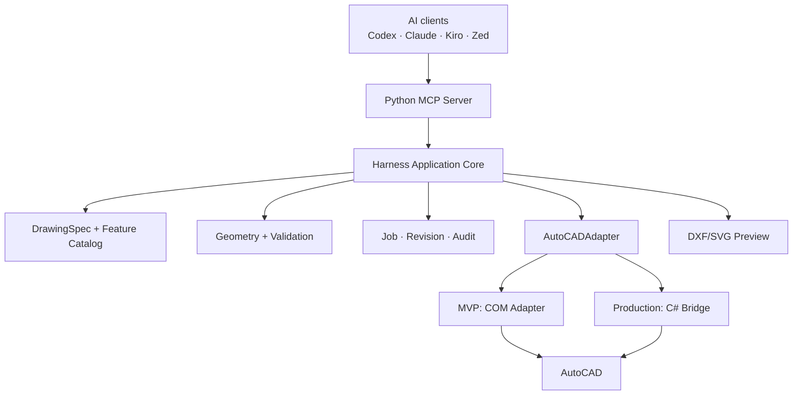
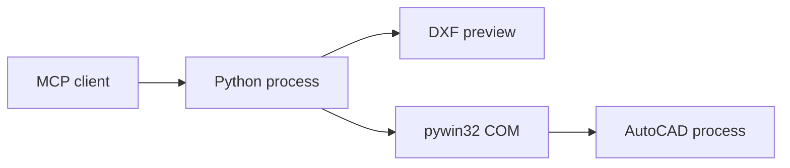
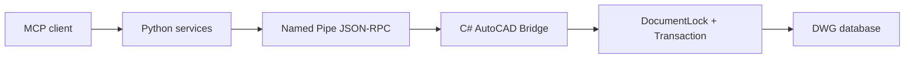
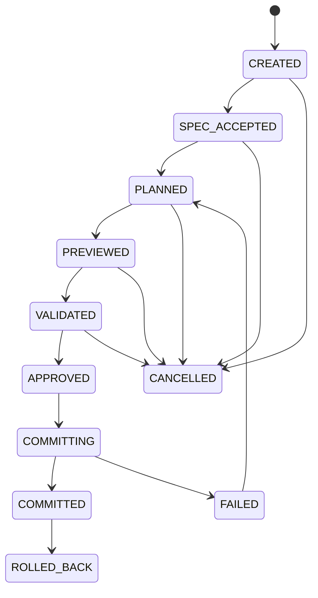
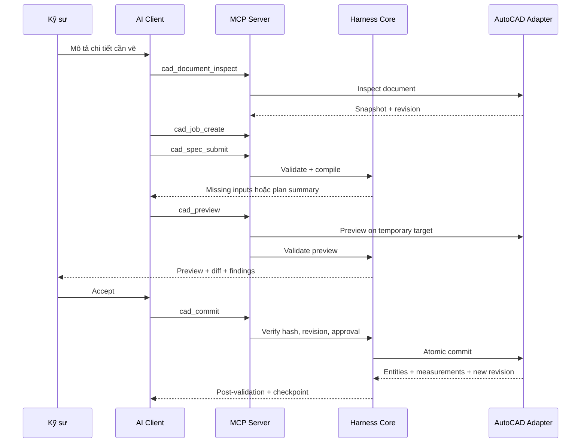

# AutoCAD Mechanical Harness Tool Builder

> Kiến trúc hệ thống hoàn chỉnh — Python-first, COM MVP, C# Bridge Production

| Thuộc tính | Giá trị |
|---|---|
| Trạng thái | Architecture Baseline v1.0 |
| Ngày cập nhật | 2026-08-02 |
| Phạm vi ban đầu | Bản vẽ chế tạo cơ khí 2D trên AutoCAD |
| Ngôn ngữ chính | Python 3.12 |
| Tích hợp MVP | Python `pywin32`/ActiveX COM |
| Tích hợp production | C#/.NET AutoCAD Bridge nhỏ, chạy trong AutoCAD |
| Giao tiếp AI | Model Context Protocol (MCP) |
| Mục tiêu người đọc | Developer, AI coding agent, kỹ sư cơ khí, QA, security reviewer |

---

## 1. Mục tiêu tài liệu

Tài liệu này là nguồn kiến trúc chuẩn để một developer hoặc AI coding agent có thể:

1. Tạo repository và các package đúng ranh giới.
2. Xây MVP chủ yếu bằng Python mà không phụ thuộc C# ngay từ đầu.
3. Kết nối Codex, Claude Code, Kiro hoặc Zed với AutoCAD qua MCP.
4. Chuyển yêu cầu ngôn ngữ tự nhiên thành bản vẽ cơ khí 2D có thể kiểm tra.
5. Bảo đảm mọi phép tính hình học là deterministic, đo lại được và có audit.
6. Preview, validation và yêu cầu kỹ sư phê duyệt trước khi sửa DWG.
7. Thay COM adapter bằng C# Bridge sau này mà không viết lại domain core.

Tài liệu này mô tả kiến trúc đích và đường chuyển đổi từ MVP tới production. Nó không phải prompt cho LLM tự ý vẽ trực tiếp trong AutoCAD.

---

## 2. Tóm tắt quyết định kiến trúc

### 2.1 Quyết định chính

> Xây 90–95% hệ thống bằng Python. Dùng COM adapter để chứng minh MVP. Khi workflow đã ổn định, bổ sung một C# AutoCAD Bridge nhỏ để có transaction, document lock, rollback và UI trong AutoCAD tốt hơn.

### 2.2 Phân chia trách nhiệm

| Thành phần | Trách nhiệm |
|---|---|
| AI client/LLM | Hiểu ý định, chọn feature, điền schema, hỏi dữ liệu còn thiếu, giải thích kết quả |
| Python MCP Server | Expose tool cấp cao, xác thực request, phân quyền, trả structured result |
| Python Harness Core | Quản lý job, revision, approval, orchestration, idempotency, audit |
| Python Mechanical Kernel | Tính tọa độ, pattern, offset, giao điểm và feature geometry theo công thức xác định |
| Validation Engine | Đo và kiểm tra geometry, drawing standard, annotation, feature constraint |
| Preview/Diff Engine | Sinh DXF/SVG/PNG tạm và semantic diff trước/sau |
| COM Adapter | Kết nối AutoCAD cho MVP qua ActiveX; không chứa business logic |
| C# Bridge | Production adapter trong process AutoCAD: lock, transaction, undo, metadata, Palette |
| Kỹ sư | Duyệt assumptions, preview, warning và quyết định commit/rollback |

### 2.3 Những lựa chọn không dùng ở MVP

- Không viết toàn bộ hệ thống bằng C++/ObjectARX.
- Không expose primitive MCP tools như `draw_line`, `trim`, `offset` cho LLM.
- Không để LLM quyết định giao điểm, tọa độ pattern hoặc tolerance cuối cùng.
- Không dùng `SendCommand` cho thao tác ghi quan trọng.
- Không commit nếu chưa preview, validation và approval.
- Không sử dụng numeric default ngầm.
- Không gửi toàn bộ DWG hoặc toàn bộ geometry cho model khi không cần thiết.

---

## 3. Phạm vi sản phẩm

### 3.1 Phạm vi MVP

- AutoCAD trên Windows.
- Bản vẽ cơ khí 2D.
- Một active document tại một thời điểm trên mỗi bridge instance.
- Feature ban đầu:
  - Rectangular plate/base plate.
  - Flange.
  - Bolt-circle pattern.
  - Rectangular hole pattern.
  - Slot/keyway 2D.
  - L-bracket 2D.
- Entity cơ bản:
  - Line, polyline, circle, arc.
  - Centerline, centermark.
  - Linear, aligned, angular, diameter và radius dimension.
  - Text/MText giới hạn.
- Company layer/dimstyle/textstyle mapping.
- ISO 2768 general tolerance dưới dạng company profile có version.
- Preview DXF/SVG/PNG.
- Validation hình học và standard.
- Commit có xác nhận.
- Export DXF/PDF.
- Audit và checkpoint.

### 3.2 Ngoài phạm vi MVP

- Solid 3D, assembly, sheet metal unfolding.
- Parametric constraint graph đầy đủ.
- Custom ObjectARX entity.
- CAM/toolpath.
- FEA, simulation hoặc automatic tolerance stack-up certification.
- Nhận dạng bản vẽ raster/PDF phức tạp.
- Cloud batch processing bằng Autodesk Automation API.
- Tự động phát hành bản vẽ production không qua con người.

### 3.3 Dữ liệu phải chốt trước pilot

Ba nhóm dữ liệu sau không được tự đoán:

1. AutoCAD version doanh nghiệp thực sự sử dụng.
2. Bộ DWT/DWS, layer, dimstyle, title block và plot profile.
3. Standard/tolerance profile: ISO, ASME, JIS hoặc quy chuẩn nội bộ.

Nếu chưa có, hệ thống chỉ chạy với `demo-profile`, không được gắn nhãn “company approved”.

---

## 4. Nguyên tắc bất biến

Các nguyên tắc sau áp dụng cho mọi giai đoạn:

1. **LLM không phải geometry kernel.** LLM tạo `DrawingSpec`; kernel tạo hình học.
2. **Không có silent default.** Mọi default phải có value, source, version và impact.
3. **Read before write.** Phải inspect document và lấy revision trước khi lập job.
4. **Preview before commit.** Bản vẽ thật không được sửa trong bước preview.
5. **Validate before and after commit.** Kết quả ghi phải được đọc lại và đo lại.
6. **Optimistic concurrency.** `expected_revision` sai thì từ chối commit.
7. **Idempotent retry.** Cùng `idempotency_key` không được tạo entity trùng.
8. **Atomic job.** Hoặc toàn bộ operation thành công, hoặc rollback/abort toàn bộ.
9. **Least privilege.** Tool đọc và tool ghi tách biệt; destructive action cần approval.
10. **Stable identity.** Feature dùng `feature_id`; không nhận diện chỉ bằng ObjectId hoặc tọa độ.
11. **Versioned contract.** Spec, plan, result và company profile đều có version.
12. **Deterministic output.** Cùng input chuẩn hóa và cùng profile phải sinh cùng semantic geometry.

---

## 5. Kiến trúc tổng thể



### 5.1 Dependency rule

Dependency chỉ đi từ ngoài vào trong:

```text
MCP / CLI / UI
    -> Application Services
        -> Domain Models + Ports
            -> Geometry / Validation Pure Core

Infrastructure adapters implement Domain Ports.
Domain Core must not import MCP, COM, AutoCAD, SQLite or UI packages.
```

### 5.2 Các lớp logic

| Lớp | Có thể phụ thuộc | Không được phụ thuộc |
|---|---|---|
| Domain | Python stdlib, math types nội bộ | MCP, COM, AutoCAD, database, GUI |
| Application | Domain ports/models | COM implementation, UI cụ thể |
| Infrastructure | Application ports, SDK bên ngoài | Business decision mới |
| Interface | Application service | Geometry công thức trực tiếp |

---

## 6. Hai deployment mode

### 6.1 Mode A — Python-only MVP



Đặc điểm:

- Nhanh để phát triển và demo.
- Preview trên file tạm.
- COM chỉ dùng object API.
- Dùng undo mark khi API hỗ trợ, checkpoint file và operation journal.
- Post-commit validation bắt buộc.
- Không cam kết atomicity tương đương AutoCAD .NET transaction cho job phức tạp.

### 6.2 Mode B — Production Bridge



Đặc điểm:

- C# Bridge chạy trong AutoCAD.
- IPC local qua Windows Named Pipe có ACL.
- Request được chuyển về đúng AutoCAD command/document context.
- Mỗi commit chạy trong transaction và undo group.
- Có thể dùng transient graphics và PaletteSet.
- Python domain core không thay đổi.

### 6.3 Điều kiện nâng cấp từ COM sang C#

Nâng cấp khi có một trong các điều kiện:

- Pilot dùng trên bản vẽ thật.
- Một job thường xuyên tạo/sửa nhiều entity liên quan.
- COM “AutoCAD is busy” ảnh hưởng trải nghiệm.
- Cần transaction atomic và document locking tin cậy.
- Cần preview trực tiếp trong viewport.
- Cần PaletteSet, reactors hoặc metadata sâu.

---

## 7. Thành phần chi tiết

### 7.1 Python MCP Server

Trách nhiệm:

- Chạy STDIO làm compatibility baseline.
- Có thể thêm Streamable HTTP cho môi trường quản lý tập trung.
- Khai báo `inputSchema` và `outputSchema` rõ ràng.
- Chỉ expose tool cấp cao.
- Map exception nội bộ thành error code có thể hành động.
- Enforce read/write/destructive permission.
- Không chứa công thức cơ khí.

Quy tắc:

- Mọi tool liên quan job phải nhận `job_id` rõ ràng.
- Mọi tool ghi phải nhận `idempotency_key`.
- `cad_commit` phải nhận `expected_revision`, `plan_hash` và `approval_token`.
- Structured result là nguồn sự thật; text chỉ là phần giải thích.
- Tool không được dựa vào hidden conversational state.

### 7.2 Harness Application Core

Các service chính:

```text
DocumentInspectionService
JobService
SpecificationService
PlanCompilerService
PreviewService
ValidationService
ApprovalService
CommitService
RollbackService
ExportService
AuditService
```

Trách nhiệm:

- Điều phối state machine.
- Kiểm tra precondition.
- Gọi feature compiler.
- Tạo plan hash.
- Chọn adapter theo cấu hình.
- Quản lý retry và idempotency.
- Chặn commit khi có blocking error.

### 7.3 DrawingSpec và Feature Catalog

`DrawingSpec` diễn tả **ý nghĩa kỹ thuật**, không diễn tả chuỗi click hoặc lệnh AutoCAD.

Mỗi feature compiler:

- Nhận typed parameter.
- Kiểm tra required input.
- Áp explicit default từ profile khi được phép.
- Sinh operation trung gian.
- Sinh constraint/measurement expectation.
- Không gọi AutoCAD trực tiếp.

Interface khái niệm:

```python
from typing import Protocol


class FeatureCompiler(Protocol):
    feature_type: str
    schema_version: str

    def validate_inputs(
        self, feature: "FeatureSpec", context: "CompileContext"
    ) -> "InputReport": ...

    def compile(self, feature: "FeatureSpec", context: "CompileContext") -> "CompiledFeature": ...
```

### 7.4 Mechanical Geometry Kernel

Trách nhiệm:

- Point/vector/line/arc/circle/polyline 2D.
- Unit normalization.
- Intersection, offset, projection.
- Fillet/chamfer calculation.
- Bolt circle và rectangular pattern.
- Slot/keyway geometry.
- Bounding box và containment.
- Distance và angle measurement.
- Tolerance-aware predicates.

Quy tắc:

- Internal canonical unit của MVP: millimetre.
- Không so sánh float trực tiếp bằng `==` cho geometry.
- Mọi predicate dùng `ToleranceProfile`.
- Hàm pure bất cứ khi nào có thể.
- Không phụ thuộc Shapely cho quy tắc có thể triển khai rõ và cần audit; Shapely có thể hỗ trợ nhưng kết quả quan trọng phải được bọc, kiểm tra và test.

### 7.5 Validation Engine

Pipeline gồm:

1. Schema validation.
2. Semantic input validation.
3. Plan validation.
4. Preview geometry validation.
5. Company standard validation.
6. Pre-commit gate.
7. Post-commit measurement validation.

Mỗi finding có:

- `rule_id`.
- `severity`: `info`, `warning`, `error`, `blocking`.
- `feature_id` hoặc `entity_ref`.
- Expected/actual/tolerance.
- Message kỹ thuật.
- Suggested fix.
- Evidence/measurement.

### 7.6 Preview và Semantic Diff

Preview không phải screenshot giả lập đơn thuần. Nó gồm:

- File DXF tạm.
- SVG/PNG để người dùng xem nhanh.
- `semantic_diff.json`.
- Validation report.
- Plan hash.

Color convention:

- Xanh lá: entity mới.
- Vàng: entity sửa.
- Đỏ: entity dự kiến xóa.
- Tím: standard violation.

Pass/fail phải dựa trên measurement và semantic rules, không dựa vào computer vision.

### 7.7 Job Store và Audit

MVP dùng SQLite ở local workstation. Production có thể chuyển sang PostgreSQL nếu nhiều workstation cần chia sẻ job.

Lưu:

- Job state.
- Document fingerprint/revision.
- Normalized spec.
- Operation plan.
- Plan hash.
- Preview artifact metadata.
- Validation findings.
- Approval record.
- Commit result.
- Entity mapping.
- Append-only audit event.

Không lưu full prompt trong telemetry mặc định.

### 7.8 AutoCADAdapter port

```python
from typing import Protocol


class AutoCADAdapter(Protocol):
    def status(self) -> "AdapterStatus": ...

    def inspect_document(self, request: "InspectRequest") -> "DocumentSnapshot": ...

    def inspect_selection(self, request: "SelectionRequest") -> "SelectionSnapshot": ...

    def preview(self, plan: "OperationPlan") -> "PreviewResult": ...

    def validate_revision(self, document_id: str, expected_revision: str) -> bool: ...

    def commit(self, request: "CommitRequest") -> "CommitResult": ...

    def rollback(self, request: "RollbackRequest") -> "RollbackResult": ...

    def export(self, request: "ExportRequest") -> "ExportResult": ...
```

Business layer chỉ biết interface này.

---

## 8. Domain model

### 8.1 Aggregate chính

| Model | Ý nghĩa |
|---|---|
| `DocumentSnapshot` | Trạng thái document tại thời điểm inspect |
| `DrawingSpec` | Yêu cầu kỹ thuật chuẩn hóa |
| `FeatureSpec` | Một feature cơ khí với tham số typed |
| `OperationPlan` | Danh sách operation deterministic để adapter thực thi |
| `ValidationReport` | Kết quả tất cả validation rule |
| `CadJob` | Aggregate quản lý toàn bộ vòng đời thay đổi |
| `ApprovalRecord` | Ai duyệt, duyệt plan nào, điều kiện gì |
| `CommitResult` | Entity thực tế, measurement và revision sau commit |
| `Checkpoint` | Điểm có thể rollback/khôi phục |

### 8.2 Job state machine



Quy tắc chuyển trạng thái:

- `SPEC_ACCEPTED` chỉ khi không còn required input bị thiếu.
- `PLANNED` chỉ khi compile deterministic thành công.
- `PREVIEWED` phải gắn với đúng `plan_hash`.
- `VALIDATED` chỉ khi report không có `blocking` finding.
- `APPROVED` chỉ áp dụng cho đúng `plan_hash` và `expected_revision`.
- Bất kỳ thay đổi spec/plan nào sau approval đều làm approval mất hiệu lực.
- `COMMITTING` phải giữ writer lease cho document.

### 8.3 Feature identity

Mỗi feature có ID ổn định, ví dụ:

```text
feature:base-plate-001
feature:base-plate-001:outline
feature:base-plate-001:hole-pattern
feature:base-plate-001:dimension-width
```

MVP lưu mapping trong job store và XData nếu COM cho phép ổn định. Production Bridge lưu trong XData hoặc Extension Dictionary với application registry riêng.

---

## 9. Workflow end-to-end



### 9.1 Happy path

1. Inspect document và selection.
2. Tạo `CadJob` với `expected_revision`.
3. Submit `DrawingSpec`.
4. Nếu thiếu dữ liệu, trả `missing_inputs`; không compile tiếp.
5. Compile spec thành `OperationPlan` canonical.
6. Hash plan.
7. Sinh preview ngoài bản DWG thật.
8. Chạy validation.
9. Kỹ sư duyệt đúng preview/hash.
10. Kiểm tra lại document revision.
11. Giữ writer lease.
12. Commit.
13. Đọc entity mới và đo lại.
14. Nếu fail: abort/undo theo adapter capability.
15. Nếu pass: tạo checkpoint, revision mới và audit event.

### 9.2 Missing input path

Ví dụ yêu cầu:

> Vẽ bích Ø160, dày 12, 8 lỗ Ø14 trên PCD120.

Nếu không có tâm, hệ thống trả:

```json
{
  "status": "needs_input",
  "error_code": "MISSING_REQUIRED_INPUTS",
  "missing_inputs": [
    {
      "path": "features[0].center_mm",
      "reason": "Center/datum is required to place the flange",
      "accepted_formats": ["[x, y]", "selected_point", "named_datum"]
    }
  ]
}
```

Không được tự dùng `[0, 0]` nếu profile không khai báo rõ đây là default được phép.

### 9.3 Stale revision path

Nếu bản vẽ thay đổi sau preview:

```json
{
  "status": "rejected",
  "error_code": "STALE_DOCUMENT_REVISION",
  "expected_revision": "sha256:...old...",
  "actual_revision": "sha256:...new...",
  "required_action": "Re-inspect, regenerate preview, validate and request approval again"
}
```

---

## 10. MCP tool surface

Chỉ expose 13 tool cấp cao:

| Tool | Side effect | Approval | Mục đích |
|---|---|---|---|
| `cad_status` | Không | Không | Kiểm tra server, adapter, AutoCAD và capability |
| `cad_document_inspect` | Không | Không | Đọc document metadata, standard, revision |
| `cad_selection_inspect` | Không | Không | Đọc selection đã giới hạn |
| `cad_feature_catalog_search` | Không | Không | Tìm feature và schema hỗ trợ |
| `cad_job_create` | Chỉ DB nội bộ | Không | Tạo job và cố định revision đầu vào |
| `cad_spec_submit` | Chỉ DB nội bộ | Không | Validate và chuẩn hóa DrawingSpec |
| `cad_change_submit` | Chỉ DB nội bộ | Không | Thay đổi spec có version |
| `cad_preview` | File tạm | Có thể auto | Sinh preview và semantic diff |
| `cad_validate` | Không sửa DWG | Không | Chạy validation theo stage |
| `cad_diff_get` | Không | Không | Lấy semantic diff và artifact refs |
| `cad_commit` | Sửa DWG | Bắt buộc | Commit plan đã duyệt |
| `cad_rollback` | Destructive | Bắt buộc | Quay lại checkpoint/undo group |
| `cad_export` | Ghi file | Bắt buộc theo policy | Xuất DWG/DXF/PDF |

### 10.1 Tool contract chung

Mọi request có thể chứa:

```json
{
  "request_id": "req_01J...",
  "schema_version": "1.0",
  "client": {
    "name": "codex",
    "version": "unknown"
  }
}
```

Mọi response dùng envelope:

```json
{
  "status": "ok",
  "request_id": "req_01J...",
  "job_id": "job_01J...",
  "data": {},
  "warnings": [],
  "audit_event_id": "evt_01J..."
}
```

Status chuẩn:

- `ok`
- `needs_input`
- `rejected`
- `conflict`
- `failed`
- `partial` chỉ dùng cho read/export batch; không dùng cho commit atomic.

---

## 11. Data contracts

Các schema chính đặt trong `contracts/` và được generate từ Pydantic khi phù hợp. JSON Schema được kiểm tra ở cả MCP boundary và adapter boundary.

### 11.1 DrawingSpec mẫu

```json
{
  "schema_version": "1.0",
  "spec_id": "spec_01J...",
  "document_id": "doc_01J...",
  "units": "mm",
  "standard_profile": {
    "profile_id": "company-mechanical-2d",
    "version": "3.0"
  },
  "drawing": {
    "projection": "orthographic",
    "view": "top",
    "datum": {
      "type": "point",
      "point_mm": [0.0, 0.0]
    }
  },
  "features": [
    {
      "feature_id": "base-plate-001",
      "type": "rectangular_plate",
      "parameters": {
        "width_mm": 160.0,
        "height_mm": 100.0,
        "thickness_mm": 12.0,
        "material": "SS400",
        "origin_mm": [0.0, 0.0]
      },
      "children": [
        {
          "feature_id": "base-plate-001-holes",
          "type": "rectangular_hole_pattern",
          "parameters": {
            "hole_diameter_mm": 14.0,
            "edge_offset_x_mm": 20.0,
            "edge_offset_y_mm": 20.0,
            "count_x": 2,
            "count_y": 2
          }
        }
      ]
    }
  ],
  "annotations": {
    "general_tolerance": "ISO 2768-m",
    "dimensions": "auto_required",
    "title_block": "company_a3_landscape"
  },
  "assumptions": [],
  "explicit_defaults": [
    {
      "path": "annotations.dimension_style",
      "value": "COMPANY-ISO-MM",
      "source": "company-mechanical-2d@3.0",
      "impact": "Controls text height, arrows and precision"
    }
  ]
}
```

### 11.2 OperationPlan mẫu

```json
{
  "schema_version": "1.0",
  "plan_id": "plan_01J...",
  "job_id": "job_01J...",
  "document_id": "doc_01J...",
  "expected_revision": "sha256:document-revision",
  "canonical_units": "mm",
  "profile_ref": "company-mechanical-2d@3.0",
  "operations": [
    {
      "operation_id": "op-outline",
      "feature_id": "base-plate-001",
      "type": "create_closed_polyline",
      "layer": "OBJECT",
      "geometry": {
        "vertices_mm": [[0, 0], [160, 0], [160, 100], [0, 100]]
      },
      "expected": {
        "closed": true,
        "area_mm2": 16000.0
      }
    },
    {
      "operation_id": "op-holes",
      "feature_id": "base-plate-001-holes",
      "type": "create_circles",
      "layer": "OBJECT",
      "geometry": {
        "centers_mm": [[20, 20], [140, 20], [20, 80], [140, 80]],
        "diameter_mm": 14.0
      },
      "expected": {
        "count": 4,
        "minimum_edge_distance_mm": 13.0
      }
    }
  ],
  "validation_expectations": [],
  "plan_hash": "sha256:canonical-json-hash"
}
```

### 11.3 OperationResult mẫu

```json
{
  "schema_version": "1.0",
  "job_id": "job_01J...",
  "plan_hash": "sha256:canonical-json-hash",
  "status": "committed",
  "entity_results": [
    {
      "operation_id": "op-outline",
      "feature_id": "base-plate-001",
      "entity_ref": "acad:handle:2AF",
      "entity_type": "AcDbPolyline",
      "measurements": {
        "closed": true,
        "area_mm2": 16000.0
      }
    }
  ],
  "previous_revision": "sha256:old",
  "new_revision": "sha256:new",
  "checkpoint_id": "checkpoint_01J..."
}
```

### 11.4 Contract versioning

- Semantic version cho schema.
- Minor version chỉ thêm optional field.
- Major version khi đổi nghĩa hoặc xóa field.
- Server hỗ trợ ít nhất current major và previous major trong thời gian migration.
- Adapter từ chối unknown major version.
- Không hash field không xác định; canonicalization phải theo schema version.

---

## 12. Defaults, assumptions và provenance

### 12.1 Phân loại input

| Loại | Ví dụ | Xử lý |
|---|---|---|
| Required engineering input | Kích thước, datum, PCD, hole diameter | Thiếu thì dừng và hỏi |
| Profile default | Layer, dimstyle, text height | Có thể áp dụng nhưng phải công khai source/version |
| Derived value | Tọa độ từng lỗ | Kernel tính, không hỏi người dùng nếu công thức đủ dữ liệu |
| Assumption | Chọn top view từ mô tả mơ hồ | Phải nêu và cần approval nếu ảnh hưởng hình học |
| Presentation preference | Màu preview | Có thể dùng app preference, không ảnh hưởng geometry |

### 12.2 Default record

```json
{
  "path": "annotations.dimension_style",
  "value": "COMPANY-ISO-MM",
  "source": "company-profile",
  "source_version": "3.0",
  "reason": "Required by drawing standard",
  "impact": "Annotation formatting only",
  "override_allowed": true
}
```

### 12.3 Blocking rule

Không được áp default cho:

- Feature size.
- Datum/origin có ảnh hưởng placement.
- Hole count/diameter/PCD.
- Material khi có ảnh hưởng annotation/BOM.
- Tolerance class.
- Projection/view orientation.
- Đơn vị khi document không xác định rõ.

Trừ khi company profile có rule explicit, versioned và user đã chọn profile đó.

---

## 13. Revision, hashing và concurrency

### 13.1 Document identity

`document_id` là identity ổn định của phiên làm việc/file, không dùng filename đơn thuần.

Nguồn có thể gồm:

- Full normalized path hash.
- AutoCAD database fingerprint GUID nếu có.
- Session instance ID.
- File metadata.

Không đưa đường dẫn nhạy cảm nguyên bản vào tool result mặc định.

### 13.2 Revision fingerprint

Revision không chỉ là thời gian sửa file. Nó nên hash canonical snapshot gồm:

- Database/file fingerprint.
- Relevant entity handles và geometric digest.
- Layer/style relevant digest.
- Current space/layout.
- Units/UCS metadata.
- Internal harness revision counter.

MVP có thể dùng coarse revision; production Bridge phải cung cấp revision đáng tin cậy hơn.

### 13.3 Plan hash

`plan_hash = SHA-256(canonical_json(OperationPlan_without_plan_hash))`

Canonical JSON yêu cầu:

- UTF-8.
- Key sort cố định.
- Không whitespace không cần thiết.
- Số được normalize theo precision policy.
- Array giữ nguyên thứ tự semantic.
- Không hash timestamp, trace ID hoặc field không ảnh hưởng plan.

### 13.4 Writer lease

- Tối đa một writer cho một `document_id`.
- Lease có owner, created time, expiry và heartbeat.
- Commit giữ lease trong thời gian ngắn nhất có thể.
- Lease hết hạn không có nghĩa commit cũ chắc chắn thất bại; phải reconcile trạng thái adapter trước retry.

---

## 14. Idempotency và retry

### 14.1 Idempotency key

Mỗi operation ghi nhận:

```text
idempotency_key = client-generated stable key
scope = document_id + tool_name
request_digest = hash(normalized request)
```

Quy tắc:

- Cùng key + cùng digest: trả lại kết quả cũ hoặc trạng thái đang chạy.
- Cùng key + khác digest: trả `IDEMPOTENCY_KEY_REUSED`.
- Không tự retry commit nếu không biết kết quả trước đã commit hay chưa.
- Reconcile bằng job status, entity mapping và revision trước khi tiếp tục.

### 14.2 Retry policy

| Lỗi | Retry tự động |
|---|---|
| Validation error | Không |
| Stale revision | Không |
| Missing input | Không |
| AutoCAD busy trước khi transaction bắt đầu | Có, bounded exponential backoff |
| IPC disconnect khi chưa gửi request | Có |
| IPC disconnect không rõ commit outcome | Không; chuyển `UNKNOWN_COMMIT_STATE` và reconcile |
| SQLite busy | Có, bounded |

---

## 15. Validation rules

### 15.1 Geometry

- Entity zero-length.
- Coordinate không finite (`NaN`, `Infinity`).
- Polyline không đóng khi expected closed.
- Polyline tự giao.
- Điểm trùng ngoài tolerance policy.
- Arc/circle radius không hợp lệ.
- Fillet không tiếp tuyến.
- Chamfer sai khoảng cách/góc.
- Duplicate hoặc overlapping entity.
- Hole nằm ngoài part boundary.
- Hole-edge distance dưới minimum.
- Hole-hole distance dưới minimum.
- Pattern sai count, pitch, PCD hoặc angle.
- Parallel/perpendicular/tangent/coincident constraint fail.
- Expected area/perimeter/extents mismatch.
- Dimension text/value không khớp measurement thực tế.

### 15.2 Drawing standard

- Units.
- Layer name/color/lineweight/linetype.
- Object placed on đúng layer.
- Dimstyle/textstyle.
- Annotation scale.
- Centerline/hidden line convention.
- Title block và required attribute.
- Layout/viewport/plot scale.
- Plot configuration.
- DWT/DWS alignment.
- Standard profile version.

### 15.3 Feature-specific

Ví dụ `rectangular_plate`:

- Width/height/thickness > 0.
- Outline có 4 cạnh orthogonal.
- Measured width/height trong tolerance.
- Child hole nằm trong outline.
- Edge distance thỏa rule.

Ví dụ `flange`:

- Outside diameter > PCD + hole diameter + 2 × minimum ligament.
- Hole count là số nguyên dương.
- Tâm hole nằm trên PCD trong tolerance.
- Angular spacing bằng `360 / count` trong tolerance.

### 15.4 Tolerance profile

```yaml
tolerance_profile:
  id: mechanical-mm-default
  version: "1.0"
  canonical_unit: mm
  absolute_length_mm: 0.001
  relative_length: 1.0e-9
  angular_deg: 0.0001
  coincidence_mm: 0.001
  area_mm2: 0.01
```

Các giá trị trên chỉ là **demo configuration**, không phải company-approved tolerance.

### 15.5 Validation gate

| Severity | Preview | Commit |
|---|---|---|
| Info | Cho phép | Cho phép |
| Warning | Cho phép | Cần hiển thị trong approval |
| Error | Cho preview | Chặn commit theo policy mặc định |
| Blocking | Chặn stage tiếp theo | Luôn chặn |

---

## 16. AutoCAD integration

### 16.1 COM Adapter cho MVP

Nguyên tắc:

- Chạy trên Windows cùng user session với AutoCAD.
- Dùng `pywin32`/ActiveX object model.
- Không dùng shell, script hoặc arbitrary AutoLISP.
- Không dùng `SendCommand` cho business operation.
- Mỗi COM call có timeout/cancellation boundary ở orchestration layer.
- Detect AutoCAD busy và trả error rõ ràng.
- Tạo entity theo thứ tự operation plan.
- Gắn feature metadata nếu ActiveX surface cho phép; luôn lưu mapping ngoài trong SQLite.
- Đọc lại property/measurement sau khi tạo.
- Dùng checkpoint copy trước commit quan trọng.
- Dùng undo mark khi có thể, nhưng không tuyên bố transaction guarantee tương đương .NET API.

COM adapter phải mỏng:

```text
OperationPlan
  -> map operation type
  -> create/update/delete AutoCAD entity
  -> return handles and measurements
```

Không đặt trong COM adapter:

- Công thức bolt circle.
- Quyết định layer theo company standard.
- Missing input logic.
- Approval logic.
- Validation business rules.

### 16.2 C# Bridge cho production

C# Bridge chỉ cần các module:

```text
CadBridge.Plugin
CadBridge.Ipc
CadBridge.Execution
CadBridge.Inspection
CadBridge.Metadata
CadBridge.Palette        # optional after core bridge
CadBridge.Contracts
```

Trách nhiệm bắt buộc:

- Named Pipe server có Windows ACL.
- Validate schema và request size.
- Chuyển execution sang AutoCAD command context.
- Chọn đúng document.
- `DocumentLock` trước write.
- Transaction cho toàn job.
- Abort nếu bất kỳ operation fail.
- Undo group cho commit.
- Stable metadata.
- Read-back measurement trước khi trả success.
- Không để exception thoát qua boundary.

Pseudo-flow:

```text
receive request
-> authenticate local client
-> validate contract/version
-> enqueue into AutoCAD context
-> verify document + revision
-> acquire document lock
-> begin undo group
-> begin transaction
-> execute all operations
-> measure and validate adapter invariants
-> commit transaction
-> end undo group
-> compute new revision
-> return result
```

Nếu lỗi trước transaction commit: abort. Nếu lỗi xảy ra sau commit nhưng trước response: đánh dấu outcome cần reconciliation bằng job/idempotency data.

### 16.3 IPC contract

- Transport: Windows Named Pipe local only.
- Encoding: UTF-8 JSON.
- Framing: length-prefixed message.
- Max request/response size cấu hình được.
- Correlation: `request_id`, `job_id`, `idempotency_key`.
- Timeout riêng cho inspect, preview, commit và export.
- Protocol handshake trả capability và supported schema version.
- Không deserialize polymorphic type tùy ý.
- Không cho client gửi .NET type name.

---

## 17. Security architecture

### 17.1 Threat model chính

- Prompt injection yêu cầu tool ghi/xóa ngoài ý định.
- LLM tạo geometry sai nhưng có vẻ hợp lý.
- Stale preview được commit lên document mới.
- Retry tạo entity trùng.
- Client khác chiếm writer.
- Named Pipe client trái phép.
- Export ghi đè file quan trọng.
- Dữ liệu bản vẽ nhạy cảm bị gửi lên cloud model.
- Audit chứa prompt hoặc đường dẫn nhạy cảm.
- Arbitrary command execution thông qua AutoCAD.

### 17.2 Controls

- Tool allowlist theo client/profile.
- Read/write/destructive scope tách biệt.
- Approval token ngắn hạn, gắn với `job_id`, `plan_hash`, `revision`.
- Path allowlist cho preview/export/checkpoint.
- Không overwrite mặc định.
- Named Pipe ACL chỉ cho user/service account được phép.
- Code signing cho plug-in/installer production.
- Request size/depth limit.
- JSON Schema validation hai đầu.
- No `eval`, shell, AutoLISP hoặc arbitrary `SendCommand`.
- Selection-scoped inspection mặc định.
- Redaction path/project/customer metadata.
- Append-only audit với hash chaining tùy mức compliance.
- Local-only mode.

### 17.3 Approval token

Approval phải chứa tối thiểu:

```json
{
  "approval_id": "approval_01J...",
  "job_id": "job_01J...",
  "document_id": "doc_01J...",
  "expected_revision": "sha256:...",
  "plan_hash": "sha256:...",
  "approved_by": "user-or-engineer-id",
  "approved_at": "2026-08-02T00:00:00Z",
  "expires_at": "2026-08-02T00:15:00Z",
  "warnings_acknowledged": ["RULE-ID"]
}
```

Thay đổi plan hoặc revision làm token vô hiệu.

### 17.4 Data minimization

MCP response ưu tiên:

- Metadata document.
- Feature summary.
- Selection geometry được người dùng cho phép.
- Measurement cần thiết.
- Artifact reference nội bộ.

Không trả toàn bộ entity database nếu tool không yêu cầu.

---

## 18. Persistence model

SQLite schema logic:

```text
documents
  document_id PK
  path_hash
  fingerprint
  current_revision
  last_seen_at

jobs
  job_id PK
  document_id FK
  state
  expected_revision
  current_spec_version
  plan_hash
  created_at
  updated_at

spec_versions
  spec_version_id PK
  job_id FK
  schema_version
  normalized_json
  content_hash
  created_at

plans
  plan_id PK
  job_id FK
  schema_version
  plan_json
  plan_hash UNIQUE
  created_at

validations
  validation_id PK
  job_id FK
  stage
  plan_hash
  report_json
  blocking_count
  created_at

approvals
  approval_id PK
  job_id FK
  plan_hash
  expected_revision
  approved_by
  expires_at

executions
  execution_id PK
  job_id FK
  idempotency_key
  request_digest
  status
  result_json
  started_at
  completed_at

entity_mappings
  document_id
  feature_id
  operation_id
  entity_ref
  last_revision

checkpoints
  checkpoint_id PK
  job_id FK
  revision
  artifact_ref
  created_at

audit_events
  event_id PK
  job_id
  event_type
  actor_type
  actor_id
  payload_redacted_json
  previous_event_hash
  event_hash
  created_at
```

### 18.1 Migration

- Alembic quản lý database migration.
- Không sửa schema thủ công trên máy pilot.
- Mỗi release chạy backup trước migration.
- Migration downgrade chỉ được dùng nếu đã test dữ liệu.

### 18.2 Retention

- Job metadata: theo policy doanh nghiệp.
- Preview tạm: TTL ngắn, ví dụ 7–30 ngày.
- Audit: retention dài hơn và append-only.
- Full drawing checkpoint: chỉ lưu trong thư mục được phép; có quota và encryption policy.

---

## 19. UI cho kỹ sư

### 19.1 MVP UI

Có thể dùng PySide6 desktop window hoặc CLI + file preview. Tối thiểu phải hiển thị:

- Active document và revision.
- Job state.
- Spec parameters.
- Missing input.
- Defaults cùng source/version.
- Assumptions.
- Preview before/after.
- Validation findings.
- `Accept`, `Reject`, `Commit`, `Rollback` theo quyền.

### 19.2 Production UI

AutoCAD PaletteSet từ C# Bridge:

- Theo active document.
- Highlight feature/entity theo finding.
- Không block command loop lâu.
- Approval phải gắn với plan hash.
- Hiển thị revision conflict ngay khi document thay đổi.

AI client không thay thế Palette. Palette là approval surface ổn định bất kể dùng Codex, Claude Code, Kiro hay Zed.

---

## 20. Error model

### 20.1 Error codes tối thiểu

```text
MISSING_REQUIRED_INPUTS
UNSUPPORTED_SCHEMA_VERSION
UNSUPPORTED_FEATURE
INVALID_FEATURE_PARAMETERS
INVALID_GEOMETRY
STANDARD_PROFILE_NOT_FOUND
STANDARD_VIOLATION
DOCUMENT_NOT_FOUND
DOCUMENT_NOT_ACTIVE
STALE_DOCUMENT_REVISION
PLAN_HASH_MISMATCH
APPROVAL_REQUIRED
APPROVAL_EXPIRED
APPROVAL_SCOPE_MISMATCH
WRITER_LEASE_CONFLICT
IDEMPOTENCY_KEY_REUSED
AUTOCAD_NOT_RUNNING
AUTOCAD_BUSY
ADAPTER_CAPABILITY_MISSING
IPC_TIMEOUT
COM_CALL_FAILED
TRANSACTION_ABORTED
POST_COMMIT_VALIDATION_FAILED
UNKNOWN_COMMIT_STATE
EXPORT_PATH_NOT_ALLOWED
ROLLBACK_NOT_AVAILABLE
INTERNAL_ERROR
```

### 20.2 Actionable error

```json
{
  "status": "rejected",
  "error": {
    "code": "PLAN_HASH_MISMATCH",
    "message": "The approved preview does not match the submitted commit plan",
    "retryable": false,
    "required_action": "Generate a new preview and request approval",
    "details": {
      "approved_plan_hash": "sha256:a",
      "submitted_plan_hash": "sha256:b"
    }
  }
}
```

Không đưa stack trace hoặc absolute sensitive path ra MCP client mặc định.

---

## 21. Observability và audit

### 21.1 Structured logging

Log field chuẩn:

```text
timestamp
level
service
event_name
request_id
job_id
document_id_pseudonym
plan_hash_prefix
adapter_type
duration_ms
outcome
error_code
```

Không log:

- Full prompt mặc định.
- Toàn bộ drawing geometry.
- Raw customer/project path.
- Approval secret/token.

### 21.2 Metrics

- Job success rate.
- Preview-to-commit conversion.
- Missing input rate theo feature.
- Validation failure rate theo rule.
- Post-commit mismatch rate.
- Duplicate prevention count.
- Stale revision rejection count.
- COM busy/error rate.
- Median/P95 preview time.
- Median/P95 commit time.
- Rollback rate.
- Engineer correction rate sau AI-generated spec.

### 21.3 Audit events

```text
DOCUMENT_INSPECTED
JOB_CREATED
SPEC_SUBMITTED
SPEC_CHANGED
PLAN_COMPILED
PREVIEW_GENERATED
VALIDATION_COMPLETED
APPROVAL_GRANTED
APPROVAL_REVOKED
COMMIT_STARTED
COMMIT_SUCCEEDED
COMMIT_FAILED
ROLLBACK_STARTED
ROLLBACK_SUCCEEDED
EXPORT_CREATED
```

---

## 22. Testing strategy

### 22.1 Test pyramid

| Test | Tỷ trọng | Chạy AutoCAD |
|---|---:|---|
| Unit test pure geometry/domain | Lớn nhất | Không |
| Property-based test | Lớn | Không |
| Contract/schema test | Lớn | Không |
| Feature compiler test | Lớn | Không |
| Golden semantic drawing test | Trung bình | Không/tuỳ adapter |
| Adapter integration test | Trung bình | Có |
| End-to-end client test | Nhỏ | Có |
| Fault injection/recovery | Nhỏ nhưng bắt buộc | Có |

### 22.2 Unit test

- Bolt circle coordinate.
- Rectangular pattern.
- Slot geometry.
- Offset/intersection edge cases.
- Unit conversion.
- Tolerance predicate.
- Canonical JSON và hash.
- State transition.
- Default provenance.
- Idempotency conflict.

### 22.3 Property-based test

Dùng Hypothesis:

- Rotation/translation không làm đổi intrinsic measurement.
- Bolt-circle point luôn cách center bằng PCD/2 trong tolerance.
- Pattern count luôn đúng.
- Closed plate area dương với kích thước hợp lệ.
- Compile cùng normalized spec luôn ra cùng hash.
- Invalid float không đi qua schema/kernel.

### 22.4 Golden drawing test

Mỗi golden case lưu:

```text
input_spec.json
company_profile.yaml
expected_plan.json
expected_semantic_entities.json
expected_validation.json
preview_reference.svg
```

Không so sánh DWG byte-for-byte vì metadata và serialization có thể đổi. So sánh semantic entities, measurement, layer/style và tolerance.

### 22.5 Adapter contract test

Cùng một suite chạy trên:

- `DxfPreviewAdapter`.
- `ComAutoCADAdapter`.
- `DotNetBridgeAdapter`.
- `FakeAutoCADAdapter`.

Kiểm tra output theo capability, không buộc mọi adapter hỗ trợ giống nhau.

### 22.6 Fault injection

- AutoCAD đóng giữa commit.
- Document đổi sau approval.
- IPC disconnect trước/trong/sau commit.
- COM busy.
- Operation thứ N fail.
- SQLite locked.
- Disk full khi tạo preview/checkpoint.
- Duplicate retry.
- Post-commit measurement mismatch.
- Approval hết hạn.

### 22.7 Client compatibility

Chạy cùng eval suite trên Codex, Claude Code, Kiro và Zed:

- Tool discovery.
- Structured input/output.
- Missing input recovery.
- Approval behavior.
- Read-only allowlist.
- Error correction.
- Long-running preview/commit progress.

---

## 23. Repository structure

```text
autocad-mechanical-harness/
├── README.md
├── pyproject.toml
├── uv.lock
├── .env.example
├── .gitignore
├── docs/
│   ├── architecture.md
│   ├── security.md
│   ├── operations.md
│   ├── feature-authoring.md
│   └── adr/
├── apps/
│   ├── mcp_server/
│   │   ├── __main__.py
│   │   ├── server.py
│   │   └── tools/
│   ├── cli/
│   └── engineer_desktop/
├── src/
│   └── cad_harness/
│       ├── domain/
│       │   ├── models/
│       │   ├── value_objects/
│       │   ├── errors.py
│       │   └── ports/
│       ├── application/
│       │   ├── services/
│       │   ├── commands/
│       │   └── queries/
│       ├── drawing_specs/
│       ├── feature_catalog/
│       │   ├── registry.py
│       │   ├── plate/
│       │   ├── flange/
│       │   ├── hole_pattern/
│       │   ├── slot/
│       │   └── bracket/
│       ├── geometry/
│       │   ├── primitives.py
│       │   ├── predicates.py
│       │   ├── intersections.py
│       │   ├── patterns.py
│       │   └── tolerance.py
│       ├── validation/
│       │   ├── engine.py
│       │   ├── findings.py
│       │   └── rules/
│       ├── company_rules/
│       │   ├── loader.py
│       │   └── profiles/
│       ├── preview/
│       ├── diff/
│       ├── persistence/
│       ├── security/
│       ├── observability/
│       └── adapters/
│           ├── base.py
│           ├── fake.py
│           ├── dxf_preview.py
│           ├── autocad_com.py
│           └── dotnet_bridge.py
├── contracts/
│   ├── drawing-spec.schema.json
│   ├── operation-plan.schema.json
│   ├── operation-result.schema.json
│   ├── validation-report.schema.json
│   └── ipc-envelope.schema.json
├── dotnet/
│   └── AutoCADBridge/
│       ├── CadBridge.Plugin/
│       ├── CadBridge.Contracts/
│       ├── CadBridge.Execution/
│       ├── CadBridge.Ipc/
│       ├── CadBridge.Tests/
│       └── AutoCADHarness.bundle/
├── tests/
│   ├── unit/
│   ├── property/
│   ├── contract/
│   ├── integration/
│   ├── golden_drawings/
│   ├── compatibility/
│   └── fault_injection/
├── scripts/
│   ├── generate_schemas.py
│   ├── run_golden_tests.py
│   └── package_release.py
└── installer/
```

### 23.1 Python package rule

- Dùng `src/` layout.
- Dùng type hints nghiêm ngặt.
- Pydantic ở boundary; domain có thể dùng frozen dataclass/value object.
- Ruff cho lint/format.
- Mypy hoặc Pyright strict dần theo package.
- Pytest + Hypothesis.
- Không import `win32com` ngoài `adapters/autocad_com.py` và helper liên quan.

---

## 24. Technology stack

| Mục | Công nghệ |
|---|---|
| Runtime chính | Python 3.12 |
| Package/dependency | `uv` + `pyproject.toml` |
| MCP | Official Python MCP SDK/FastMCP-compatible surface |
| Schema | Pydantic v2 + JSON Schema |
| Geometry | Python math core, NumPy; Shapely qua wrapper có kiểm soát |
| DXF | ezdxf |
| COM | pywin32 |
| Database | SQLite + SQLAlchemy + Alembic |
| Desktop UI | PySide6, nếu cần |
| Test | pytest + Hypothesis |
| Logging | structlog hoặc Python structured logging |
| C# Bridge | .NET tương thích với AutoCAD target version |
| IPC | Windows Named Pipe |

Version cụ thể phải pin trong lockfile và xác nhận lại với AutoCAD version thực tế trước release.

---

## 25. Configuration

Ví dụ `config/base.yaml`:

```yaml
app:
  environment: development
  local_only: true

mcp:
  transport: stdio
  protocol_compatibility_baseline: "2025-11-25"
  enable_newer_protocol_by_feature_flag: true

adapter:
  type: com
  autocad_prog_id: AutoCAD.Application
  inspect_timeout_seconds: 15
  commit_timeout_seconds: 120

storage:
  sqlite_path: ./data/harness.db
  preview_directory: ./data/previews
  checkpoint_directory: ./data/checkpoints

security:
  require_commit_approval: true
  require_rollback_approval: true
  allow_arbitrary_export_path: false
  redact_document_paths: true

geometry:
  canonical_unit: mm
  tolerance_profile: demo-mechanical-mm@1.0

standards:
  company_profile: demo-profile@1.0
```

Không commit secret, user path hoặc company confidential profile vào public repository.

---

## 26. Build và deployment

### 26.1 Development

```text
Python virtual environment
-> install locked dependencies
-> migrate SQLite
-> run unit/contract tests
-> run MCP server in STDIO
-> connect test client
-> use Fake/DXF adapter by default
```

COM integration chỉ chạy trên Windows có AutoCAD và được đánh dấu integration test.

### 26.2 MVP release

Bao gồm:

- Python runtime/package.
- MCP server launcher.
- Config templates.
- SQLite migrations.
- Demo company profile.
- COM adapter.
- CLI/desktop approval UI tối thiểu.
- Signed checksum.
- Installation và rollback guide.

### 26.3 Production release

Thêm:

- C# AutoCAD plug-in `.bundle`.
- `PackageContents.xml` theo target AutoCAD version.
- Code signing.
- Named Pipe ACL installer.
- Version compatibility matrix.
- Health check.
- Crash recovery/checkpoint policy.

Không cố phát hành một DLL cho mọi AutoCAD version nếu runtime/API không tương thích.

---

## 27. Roadmap triển khai

### Phase 0 — Discovery, 1–2 tuần

Deliverables:

- AutoCAD version matrix.
- Chọn 2D-only MVP.
- Thu DWT/DWS/standard.
- 30–50 golden drawings.
- Danh sách 5 feature đầu.
- Threat model và data classification.

Exit criteria:

- Mỗi golden drawing có input spec mong muốn và measurement chính.
- Kỹ sư domain phê duyệt feature definition.

### Phase 1 — Pure Python Core, 2–3 tuần

Deliverables:

- Repository skeleton.
- Pydantic contracts.
- Job state machine.
- Geometry primitives/tolerance.
- Five feature compilers.
- Validation rule framework.
- Fake adapter.
- Unit/property tests.

Exit criteria:

- Compile deterministic.
- Không cần AutoCAD để chạy test.
- Cùng spec sinh cùng plan hash.

### Phase 2 — Preview + MCP, 2–3 tuần

Deliverables:

- MCP server.
- 13 tool contracts.
- DXF/SVG preview.
- Semantic diff.
- SQLite/audit.
- Missing-input workflow.
- Approval record.

Exit criteria:

- AI client có thể tạo job, submit spec, preview, validate.
- Chưa có tool nào sửa DWG thật nếu không approval.

### Phase 3 — COM MVP, 2–3 tuần

Deliverables:

- Document/selection inspect.
- Entity create/update mapping.
- Revision checking.
- Checkpoint và undo mark.
- Post-commit measurement.
- Export.

Exit criteria:

- 20–30 golden cases commit thành công.
- Retry không tạo duplicate.
- Stale revision bị từ chối.

### Phase 4 — Hardening + Pilot, 3–5 tuần

Deliverables:

- Fault injection.
- Installer.
- Security controls.
- Client compatibility suite.
- Metrics/dashboard.
- Pilot với 5–10 kỹ sư.

Exit criteria:

- Không có blocking safety issue.
- Post-commit mismatch rate đạt ngưỡng pilot đã thống nhất.
- Kỹ sư hiểu preview, default và warning.

### Phase 5 — C# Bridge, sau khi MVP chứng minh giá trị

Deliverables:

- Named Pipe contract.
- AutoCAD command-context execution.
- `DocumentLock` + transaction.
- Atomic abort.
- Stable metadata.
- PaletteSet tối thiểu.
- Bundle installer.

Exit criteria:

- Cùng adapter contract suite pass.
- Python core không thay đổi public contract.
- Failure giữa operation không để lại partial geometry.

---

## 28. Acceptance criteria

### 28.1 Bắt buộc cho MVP

- [ ] Không có numeric engineering default ngầm.
- [ ] Missing input trả field path và cách bổ sung.
- [ ] Mỗi job có `job_id`, `document_id`, `expected_revision`.
- [ ] Mỗi plan có deterministic `plan_hash`.
- [ ] Preview không sửa active DWG.
- [ ] Commit yêu cầu approval gắn với đúng hash/revision.
- [ ] Stale revision luôn bị từ chối.
- [ ] Retry cùng idempotency key không tạo duplicate.
- [ ] Geometry được validate trước commit.
- [ ] Entity được đo lại sau commit.
- [ ] Validation result có expected/actual/tolerance.
- [ ] Audit ghi đủ lifecycle event nhưng không lưu full prompt mặc định.
- [ ] Export bị giới hạn trong allowlist path.
- [ ] Golden semantic test pass trên feature MVP.

### 28.2 Bắt buộc trước production

- [ ] C# Bridge chạy trong đúng AutoCAD context.
- [ ] Document lock trước write.
- [ ] Một transaction cho toàn commit job.
- [ ] Failure giữa job abort hoàn toàn.
- [ ] Một undo group cho một commit.
- [ ] Named Pipe có ACL.
- [ ] Plug-in/installer được code-sign.
- [ ] Stable feature ID tồn tại trong drawing metadata.
- [ ] Unknown commit state có reconciliation procedure.
- [ ] Compatibility test pass với AutoCAD target versions.
- [ ] Security review và recovery drill hoàn tất.

### 28.3 Chất lượng pilot đề xuất

- ≥ 95% golden cases sinh đúng semantic geometry.
- 100% stale revision bị chặn.
- 100% blocking validation chặn commit.
- 0 duplicate entity trong idempotency retry suite.
- 0 partial commit trong C# transaction fault suite.
- P95 preview cho case MVP dưới ngưỡng do nhóm dự án thống nhất.
- Mọi correction của kỹ sư được trace tới spec/plan/rule cụ thể.

---

## 29. Definition of Done cho một feature mới

Một feature chỉ được đưa vào catalog khi có:

- [ ] Feature schema và version.
- [ ] Required/optional parameter rõ ràng.
- [ ] Không có silent default.
- [ ] Compile function deterministic.
- [ ] Validation rule.
- [ ] Dimension/annotation rule nếu áp dụng.
- [ ] Unit tests.
- [ ] Property-based tests phù hợp.
- [ ] Tối thiểu 3 golden cases: normal, boundary, invalid.
- [ ] Preview hỗ trợ.
- [ ] COM adapter mapping hoặc capability báo không hỗ trợ.
- [ ] Documentation và ví dụ prompt/spec.
- [ ] Security/data exposure review.

---

## 30. Architectural Decision Records

### ADR-001 — Python-first

**Decision:** Python là ngôn ngữ chính cho MCP, application core, schema, geometry orchestration, validation và persistence.

**Reason:** Phù hợp năng lực hiện tại, tốc độ phát triển nhanh, ecosystem tốt và dễ test.

**Consequence:** Cần kỷ luật kiến trúc để tránh trộn COM vào domain.

### ADR-002 — COM là adapter tạm cho MVP

**Decision:** Dùng `pywin32` ActiveX cho MVP.

**Reason:** Cho phép chứng minh value mà chưa cần học C# sâu.

**Consequence:** Atomicity và command-context control hạn chế; pilot phải có checkpoint và post-validation.

### ADR-003 — C# Bridge cho production

**Decision:** Khi đi production, triển khai plug-in C# nhỏ thay cho COM write path.

**Reason:** Cần DocumentLock, transaction, undo, metadata và Palette ổn định.

**Consequence:** Phải duy trì IPC contract và build theo AutoCAD version.

### ADR-004 — High-level MCP tools

**Decision:** Expose feature/job-level tool, không expose primitive drawing tools.

**Reason:** Giảm tool misuse, context size và nguy cơ LLM tự xây geometry sai.

### ADR-005 — Human approval bắt buộc

**Decision:** Commit/rollback/overwrite cần approval.

**Reason:** Bản vẽ cơ khí có hậu quả kỹ thuật; preview và validation không thay thế trách nhiệm kỹ sư.

### ADR-006 — Semantic golden testing

**Decision:** So sánh semantic geometry và measurements, không so byte DWG.

**Reason:** Byte representation có thể đổi dù bản vẽ tương đương.

### ADR-007 — C++ không thuộc MVP

**Decision:** Không dùng C++/ObjectARX trong bản đầu.

**Reason:** Chi phí build/debug và crash risk không tương xứng với phạm vi 2D MVP.

**Revisit when:** Cần custom entity, native graphics sâu hoặc hiệu năng cực lớn.

---

## 31. Rủi ro và biện pháp

| Rủi ro | Tác động | Biện pháp |
|---|---|---|
| COM không ổn định khi AutoCAD busy | Commit fail/treo | Timeout, bounded retry trước write, explicit busy state, C# roadmap |
| Spec từ AI sai nghĩa kỹ thuật | Geometry sai | Typed schema, missing input, preview, engineer approval |
| Default công ty chưa đầy đủ | Drawing không đúng standard | Provenance, demo label, blocking rule |
| Revision fingerprint yếu ở MVP | Commit lên bản đã đổi | Inspect gần commit, coarse digest + session counter, C# bridge sau pilot |
| Golden set không đại diện | Chất lượng pilot ảo | Kỹ sư chọn 30–50 drawing thật, edge cases |
| Lưu quá nhiều geometry vào log | Rò rỉ IP | Redaction, local-only, retention, selection scope |
| C# Bridge phát triển muộn | Technical debt COM | Giữ adapter port/contract từ ngày đầu |
| Multi-client khác nhau | Tool behavior lệch | Lowest-common-denominator MCP + compatibility suite |

---

## 32. Case study pilot chuẩn

### Input

> Tạo bản vẽ chế tạo tấm đế 160×100×12 mm, 4 lỗ Ø14 cách mép 20 mm, thép SS400, dung sai chung ISO 2768-m, dùng template công ty.

### Expected specification

- Feature: rectangular plate.
- Width: 160 mm.
- Height: 100 mm.
- Thickness: 12 mm.
- Material: SS400.
- Hole count: 4.
- Hole diameter: 14 mm.
- Edge offset X/Y: 20 mm.
- General tolerance: ISO 2768-m.
- Template: company-selected profile.
- Datum/origin: phải được chọn hoặc khai báo rõ.

### Expected validations

- Outline 160 × 100 mm.
- 4 circles Ø14.
- Center tọa độ theo datum và offset.
- Hole-edge distance hợp lệ.
- Hole nằm trong boundary.
- Dimension value khớp measurement.
- Layer/style/title block đúng profile.
- Không duplicate/overlap bất hợp lệ.

### Demo success

1. AI nhận ra datum còn thiếu nếu chưa có selection/default hợp lệ.
2. Kernel tính chính xác bốn tâm lỗ.
3. Preview hiển thị diff.
4. Validation giải thích kết quả theo rule.
5. Commit chỉ chạy sau approval.
6. Post-validation đo lại entity.
7. Audit có thể truy ngược từ entity tới feature/spec.

---

## 33. Hướng dẫn cho AI coding agent

Khi triển khai repository từ tài liệu này, AI agent phải tuân thủ thứ tự:

1. Không code COM hoặc C# trước domain model và adapter protocol.
2. Tạo Pydantic contracts và JSON Schema trước.
3. Tạo fake adapter để unit/integration test không cần AutoCAD.
4. Tạo job state machine và precondition guard.
5. Tạo geometry pure functions với tolerance policy.
6. Triển khai từng feature theo Definition of Done.
7. Tạo preview DXF/SVG.
8. Tạo validation engine.
9. Expose MCP tools cấp cao.
10. Thêm COM adapter cuối MVP.
11. Không tự mở rộng scope sang 3D/C++.
12. Không thay giá trị kỹ thuật bị thiếu bằng magic number.

Mỗi PR/iteration phải trả lời:

- Contract nào thay đổi?
- Rule nào được thêm?
- Test nào chứng minh deterministic?
- Có side effect mới không?
- Approval/security có bị ảnh hưởng không?
- COM/AutoCAD dependency có lọt vào domain không?

---

## 34. Tài liệu tham khảo chính thức cần kiểm tra khi triển khai

- [AutoCAD Developer Documentation](https://help.autodesk.com/view/OARX/2026/ENU/)
- [AutoCAD Managed .NET Transaction Manager](https://help.autodesk.com/cloudhelp/2026/HUN/OARX-DevGuide-Managed/files/GUID-12ADA0F2-C44D-4D88-B248-1803D39DF3AA.htm)
- [AutoCAD .NET compatibility](https://help.autodesk.com/cloudhelp/2026/KOR/AutoCAD-Customization/files/GUID-A6C680F2-DE2E-418A-A182-E4884073338A.htm)
- [Autodesk plug-in package reference](https://help.autodesk.com/cloudhelp/2026/DEU/AutoCAD-MAC-Customization/files/GUID-BC76355D-682B-46ED-B9B7-66C95EEF2BD0.htm)
- [Model Context Protocol tools specification](https://modelcontextprotocol.io/specification/2026-07-28/server/tools)
- [MCP SDK documentation](https://modelcontextprotocol.io/docs/2026-07-28/sdk)
- [Codex MCP documentation](https://learn.chatgpt.com/docs/extend/mcp)
- [Claude Code MCP documentation](https://code.claude.com/docs/en/mcp)
- [Kiro MCP configuration](https://kiro.dev/docs/mcp/configuration/)
- [Zed MCP documentation](https://zed.dev/docs/ai/mcp)

Version/API compatibility phải được xác nhận lại trong sprint triển khai; không hard-code quyết định runtime chỉ dựa trên tài liệu kiến trúc này.

---

## 35. Kết luận

Kiến trúc tối ưu cho dự án là:

```text
Python MCP Server
  + Python Harness/Application Core
  + Python Mechanical Geometry and Validation
  + DXF/SVG Preview
  + SQLite Job/Revision/Audit
  + COM Adapter cho MVP
  + C# AutoCAD Bridge nhỏ cho production
```

Giá trị cốt lõi nằm ở schema kỹ thuật, feature compiler, geometry deterministic, validation, revision, approval và audit. COM/C# chỉ là adapter thực thi. Thiết kế này giúp bắt đầu ngay bằng Python, giới hạn rủi ro, đồng thời giữ đường nâng cấp production mà không phải viết lại toàn bộ hệ thống.
